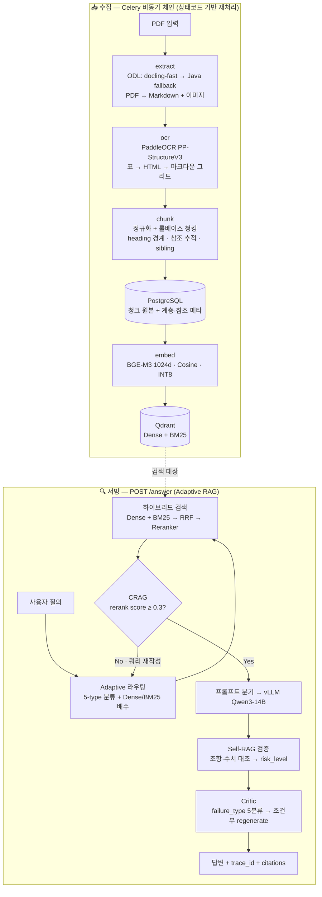

<div align="center">

# 📄 docs-rag

**검증까지 내장한 한국어 문서 RAG 파이프라인**

*Production-grade Korean RAG for structured PDFs — 하이브리드 검색 · 자기 교정 · 정직한 평가*

<p>
  
  
  
  
  
  
  
</p>

[아키텍처](docs/architecture.md) · [API](docs/api.md) · [파이프라인](docs/pipeline.md) · [청킹](docs/chunking.md) · [로드맵](docs/roadmap.md) · [📓 Notion 설계 근거](https://www.notion.so/DocsRAG-31b9fb2de50b80b59e04d05d8985ceca)

</div>

---

약관·법령·매뉴얼 같은 **한국어 구조화 PDF**를 등록하면 — 자동으로 분류·추출·OCR·청킹·임베딩해서 인덱싱하고, **하이브리드 검색 + LLM 답변 생성 + 자기 검증(Self-RAG)·자기 교정(CRAG·Critic)** 까지 한 번에 처리하는 End-to-End 파이프라인. 현재 운영 corpus는 보험·법령이지만 **도메인 비종속** — 라우팅 정규식/프롬프트 템플릿만 바꾸면 다른 도메인에 재사용된다.

> 이 프로젝트의 차별점은 *"동작하는 RAG"* 가 아니라 **"틀렸을 때 스스로 알고, 무엇을 못 하는지 정직하게 문서화한 RAG"** 다. 평가 지표 · 아직 못 잡는 케이스 · 의도적 미구현과 그 도입 트리거까지 전부 공개한다 — [설계 철학 · 정직한 한계](#-설계-철학--정직한-한계) 참조.

### 🏗️ 파이프라인 한눈에 보기



---

## ✨ 핵심 특징

- 🔀 **하이브리드 검색** — BGE-M3 Dense + Qdrant BM25를 **RRF**로 융합, CrossEncoder 리랭킹, sibling ±2 복원, 토큰 예산 knapsack
- 🧭 **Adaptive 라우팅** — 질의를 **5-type 정규식**으로 분류 → Dense/BM25 배수·프롬프트 분기, 비교 질의는 분해 후 검색 (분류·검증은 전부 **0ms 결정론적**, LLM 호출은 4곳뿐)
- 🔁 **자기 교정 루프** — **CRAG**(검색 품질 게이트 → 쿼리 재작성·재검색) + **Self-RAG**(조항·수치 구조 검증) + **Critic**(실패 5분류 → 조건부 재생성, 외부 피드백 조건 준수)
- 📄 **구조 보존 인제스천** — ODL(docling-fast→Java)로 다단 레이아웃·읽기순서 보존, **PaddleOCR PP-StructureV3로 스캔·이미지 표를 HTML 구조 복원 → 마크다운 그리드** (셀 병합·헤더 인식)
- 🛡️ **4층 가드레일** — PII 마스킹 · Prompt Injection · Grounding(inline citation) · Output leak 제거 (OWASP LLM Top-10 매핑)
- 🔬 **12-섹션 서빙 trace** — 요청마다 route·CRAG·검증·critic·latency를 JSONL 1줄로 기록 → 집계·SLA 기준선·회귀 감지
- 📊 **정직한 평가** — RAGAS Triad(judge 분리로 self-preference bias 회피) + 못 잡는 케이스·의도적 미구현까지 문서화
- ⚙️ **장애 복원 설계** — 상태코드 기반 재처리(실패 지점부터), feature flag 즉시 롤백, CQRS 상태 관리

---

## 🚀 빠른 시작

```bash
# 1. 전체 스택 빌드 + 기동 (API · Celery · vLLM · Qdrant · PostgreSQL · RabbitMQ · OCR)
docker compose build && docker compose up -d
docker compose ps                                # 서비스 상태
docker compose logs -f api celery                # 파이프라인 로그

# 2. 문서 등록 → 비동기 extract→ocr→chunk→embed 체인 발행
curl -X POST localhost:8002/api/v1/docs-rag/documents \
  -H 'Content-Type: application/json' \
  -d '{"service_code":"01","document_id":"0001","document_name":"약관.pdf","document_path":"/data/input/약관.pdf"}'

# 3. 질의 → CRAG + Self-RAG + Critic 적용, 응답에 trace_id·citations 포함
curl -X POST localhost:8002/api/v1/docs-rag/answer \
  -H 'Content-Type: application/json' \
  -d '{"query":"무면허운전 시 보험금 지급이 되나요?","service_code":"01"}'
```

> 상세 구성·포트·GPU 배치·장애 대응은 [docs/architecture.md](docs/architecture.md). 자주 쓰는 명령 alias는 [Makefile](Makefile).

---

## 🔧 어떻게 동작하나

### 수집 (Ingestion) — `extract → ocr → chunk → embed`

| 스테이지 | 하는 일 | 핵심 설계 |
|---|---|---|
| **① extract** | ODL(`opendataloader-pdf`)로 PDF → Markdown + 내부 이미지 | ≤200p `docling-fast`(hybrid ML) 시도 → 품질 미달 시 Java fallback / >200p Java-direct. XY-Cut++ 읽기순서·구조 보존, 헤더·푸터·워터마크 자동 제거, **로컬 실행·데이터 유출 0%** |
| **② ocr** | 삽입·스캔 이미지를 PaddleOCR로 구조화 | PP-StructureV3(layout+table+formula+OCR). **표는 HTML 구조로 복원 → 마크다운 그리드 변환**, 6단계 입구 필터로 garbage 컷 (아래 상세) |
| **③ chunk** | 텍스트 정규화 + 룰베이스 청킹 + OCR 청크 합류 | **경계 3원칙** — (1) heading→새 청크, (2) paragraph/table/list 의미 단위 보존, (3) 조항 번호 패턴→참조 관계 기록. Adaptive(헤딩 트리·sibling 복원) / Fixed(800·150 오버랩) |
| **④ embed** | 청크 → BGE-M3 → Qdrant 적재 | 1024차원·Cosine·INT8 양자화. Dense와 함께 BM25 벡터(`content-bm25`) 병행, 1000개 배치 upsert. 리랭커 `bge-reranker-v2-m3` |

<details>
<summary><b>📄 PaddleOCR — 표·이미지 구조 복원 상세 (표 → HTML → 마크다운)</b></summary>

스캔본·이미지형 페이지, 그리고 텍스트 PDF 안에 박힌 이미지를 **개별 이미지 단위**로 PP-StructureV3에 태워 구조를 복원한다.

- **SR (Super-Resolution)** — 저화질 스캔을 300+DPI로 보정해 OCR 인식률 향상
- **표 구조 재구성** — 셀 병합·헤더 행 인식 후 PP-StructureV3의 `table_res_list` **HTML**을 celery `_html_table_to_markdown()`이 **마크다운 표**로 변환. 평문에 안 섞이게 `chunk_type="table"` 별도 청크로 저장 → LLM이 표를 표로 인식
- **`is_valid_image` 6단계 입구 필터** — 파일크기 / 최소차원 / figure 최소크기 / 종횡비 / 최대차원 / 단색(stddev) 로 1px spacer·아이콘·로고·QR·가로띠·투명 마스크를 컷 → garbage에 paddle 호출 낭비 안 함
- **저장 산출물** — 이미지 옆에 `_ocr.json`(rec_texts·layout_boxes·parsing_blocks) + `_ocr_layout.png`. confidence 컷(`LAYOUT/REC_MIN_SCORE=0.5`) 통과분만 기록
- **CPU 고정** — Blackwell sm_120이 현재 paddle 빌드에 미포함이라 CPU 모드. Paddle 3.4+ 공식 지원 시 3곳 토글로 GPU 복귀

같은 이미지에서 나온 image/table 청크는 동일 `heading_path`를 공유 → sibling 복원 시 함께 LLM context로. 상세: [docs/chunking.md](docs/chunking.md)

</details>

### 서빙 (Serving) — `POST /answer`

한 번의 호출에 **라우팅 → CRAG → 프롬프트 분기 → 생성 → Self-RAG → Critic**이 순차 적용된다. 분류·검증·failure type 판정은 전부 **결정론적(정규식·집합 비교) → 0ms**, LLM 호출은 4곳(비교 분해 fallback · CRAG 쿼리 재작성 · 답변 생성 · 조건부 regenerate)뿐. 단계별 실행 주체·구현 위치는 [docs/pipeline.md](docs/pipeline.md).

<details>
<summary><b>⚙️ 상태 코드 — 실패 지점부터 재처리</b></summary>

```
00(대기) → 22(추출중) → 21(추출완료) → 24(OCR중) → 23(OCR완료)
→ 32(청킹중) → 31(청킹완료) → 42(임베딩중) → 43(임베딩완료) → 41(벡터DB적재) → 11(완료)
에러: 91(추출) / 92(OCR) / 93(청킹) / 94(청킹·DB) / 95(임베딩) / 96(임베딩·벡터DB) / 99(기타)
```

단계 완료마다 `tb_document_status`(읽기용) + `tb_document_status_log`(append-only)에 CQRS로 기록 → 장애 발생 시 마지막 성공 상태부터 재처리. 브로커는 RabbitMQ.

</details>

---

## 🔌 API 엔드포인트

| Method | Path | 역할 |
|---|---|---|
| `POST` | `/api/v1/docs-rag/documents` | PDF 등록 + Celery 체인 발행 |
| `GET` | `/api/v1/docs-rag/documents/{service}/{id}` | 처리 상태 조회 |
| `POST` | `/api/v1/docs-rag/retrieve` | 하이브리드 검색 + 리랭킹 (`trace_id` 포함) |
| `POST` | `/api/v1/docs-rag/answer` | RAG 질의응답 (CRAG + Self-RAG + Critic) |
| `POST` | `/api/v1/docs-rag/embeddings` | 텍스트 → BGE-M3 벡터 |
| `POST` | `/api/v1/docs-rag/feedback` | 사용자 피드백 수집 (`trace_id` + signal + free_text) |

스키마·에러 코드·필터링·멱등성: [docs/api.md](docs/api.md)

---

## 📊 평가 (Evaluation)

평가셋 24문항(보험 약관 0011·0012·0013), 동일 배치로 측정한 RAGAS Triad + 운영 trace 27건 — judge는 GPT-4o-mini로 **분리**(serving=Qwen3), self-preference bias 회피.

| 지표 | 값 | SLA 목표 | 판정 |
|---|---|---|---|
| RAGAS Faithfulness | **0.69** | — | LLM judge=GPT-4o-mini |
| RAGAS Answer Relevancy | **0.62** | — | |
| RAGAS Context Utilization | **0.92** | — | |
| Groundedness (regex verifier) | **mean 0.59 / p50 0.67 / p95 1.00** | — | `supported/verifiable` — literal ref 일치 요구라 LLM judge보다 엄격 |
| Routing accuracy | **83.3%** (20/24) | — | 5-type regex classifier · 4건은 절차/해석 경계 |
| `/answer` p50 latency | **5.6s** | ≤ 10s | ✅ |
| `/answer` p95 latency | **14.4s** | ≤ 10s | ⚠️ vLLM util 0.30 + KV fp8 절충 |
| CRAG 트리거율 | **7.7%** (2/26) | ≤ 30% | ✅ |
| CRAG 재시도 후 개선률 | **100%** (2/2) | ≥ 70% | ✅ avg Δscore +0.40 |
| Critic regenerate improved | **14.3%** (1/7) | ≥ 40% | ⚠️ 소표본 + regex 한계 (NLI judge 도입 트리거) |
| 서빙 trace write 실패 | **0건** | 0% | ✅ |

<details>
<summary>수치 해석 · 정합성 노트</summary>

- 수치는 `data/eval/ragas_eval_result.json` / `data/eval/trace_summary_YYYYMMDD.json`에 보관 (운영 환경 재측정 가능).
- **정합성**: regex verifier(0.59) < LLM judge(0.69) — 같은 faithfulness 개념이지만 측정 방식 차이(literal ref 일치 vs 의미 판정). 둘 다 1.0 미만 = 답변·verifier 양쪽에 개선 여지가 있음을 정직하게 노출.
- **Critic regenerate 낮은 이유**: 한국어 다층 조항 표기("특별약관 제5장 제3조")를 정규식 verifier가 collapse해서 hint가 무용한 케이스 다수. `CRITIC_DISPATCH_ENABLED=false` 한 줄로 즉시 비활성화 가능.

</details>

---

## 🧠 설계 철학 · 정직한 한계

> **검증된 것(측정된 이득)만 메인 경로에.** 검증 안 된 컴포넌트를 끼우면 false positive가 신뢰도를 오히려 깎는다. 그래서 무엇을 왜 안 만들었고, 무엇을 아직 못 잡는지, 언제 도입할지를 전부 문서로 남긴다 — 이 섹션이 이 프로젝트의 시그니처다.

<details>
<summary><b>🧩 5-레이어 구현 상태</b> (Naive → Advanced → Modular → Adaptive → Agentic)</summary>

Gao et al. (2023/2024), Singh et al. (2025) taxonomy 기준:

| 레이어 | 구현 |
|---|---|
| **Naive** | retrieve → generate 기본 플로우 |
| **Advanced** | Hybrid Search (BGE-M3 Dense + Qdrant BM25 + RRF), CrossEncoder 리랭킹, Sibling ±2 복원, 토큰 예산 knapsack |
| **Modular** | `rag/router.py`·`grader.py`·`prompts.py`·`trace.py` 모듈 분리 |
| **Adaptive** | 5-type regex classifier + Dense/BM25 factor 분기 + COMPARISON decomposition (rule→llm fallback) + 5종 프롬프트 템플릿 |
| **Agentic (Reflection + Evaluator-optimizer)** | (1) CRAG retrieval gate, (2) Self-RAG 구조 검증, (3) **Critic-guided regeneration** — failure type 5분류 + hint-guided regenerate 1회 (retrieval_gap은 regenerate 금지 + escalation — Huang et al. ICLR 2024 준수), (4) **Feedback loop** — `POST /feedback` + `trace_id` 조인 |

의미 일치 검증(NLI/HHEM)은 `semantic_judge` 주입 슬롯으로 준비만(기본 비활성). 의도적 제외: Planning / Tool Use / Multi-agent (closed corpus · single-shot 비중 높음).

</details>

<details>
<summary><b>🚫 검증되지 않은 영역</b> (구조 검증이 못 잡는 케이스 — 의도적 미구현)</summary>

결정론적 구조 검증(정규식 조항·수치 추출 + 단위 정규화 + 집합 비교)으로 1차 게이트를 구성. 아래는 본질적 한계로 **현재 못 잡음** — 검증된 한국어 도메인 NLI/LLM judge 없이 무리 도입하면 false positive로 신뢰도가 하락하기 때문.

| 케이스 | 예시 | 현재 동작 |
|---|---|---|
| 의미 반전 | context "보장하지 아니합니다" / answer "보장됩니다" | pass 통과 (구조·수치 일치) |
| 동일 조항 다른 대상 | "자가용 1,000만/영업용 500만" → 자가용 질문에 "500만" | numeric 일치라 통과 |
| 조건부 진술의 조건 누락 | "단, 음주운전 시 제외" → answer는 "보장"만 | 부분 진실로 통과 |
| 시제·양상 차이 | "지급할 수 있습니다"(재량) → "지급합니다"(의무) | 검출 안 됨 |
| 미등록 단위 | "최대 1.5배 보장", "체중 80kg" | 추출 0 |

**도입 조건** (`semantic_judge` slot에 NLI/LLM judge 주입 시): ① 한국어 도메인 평가셋(정상+반전 각 50건+) ② 후보(HHEM-2.1 / Azure Groundedness / NLI / GPT-4o) precision/recall 측정 ③ **precision ≥ 0.9** 통과분만 채택 ④ sidecar 비교 후 메인 도입. 충족 전까지 slot 비워두는 게 가장 안전.

</details>

<details>
<summary><b>🛡️ 가드레일 6계층</b> (4계층 구현 + 2계층 의도적 미구현)</summary>

| 계층 | 구현 상태 |
|---|---|
| Input Guard | ✅ PII 마스킹 5종(RRN/CARD/PHONE/ACCOUNT/EMAIL) + Injection 정규식 7종 + zero-width 차단. OWASP LLM06+LLM01. Presidio/Lakera 어댑터 교체 가능 |
| Retrieval Guard | ✅ CRAG evaluator — top-1 rerank < 0.3 시 쿼리 재작성 → 재검색(최대 2회) |
| Grounding Guard | ✅ verify_answer(조항·별표·숫자 검증) + Groundedness 0~1 + inline citation (claim↔chunk) |
| Output Guard | ✅ role token leak(ChatML/Llama/system:) silent 제거 + 욕설 라벨. OWASP LLM02 |
| Access Guard | ❌ 사내 단일 vLLM에서 자연 큐잉 → YAGNI. 트리거: 외부 노출 시 slowapi |
| Action Guard | ❌ read-only RAG라 자리 없음. 트리거: tool calling 도입 시 |

</details>

<details>
<summary><b>🧯 의도적 미구현 (Anti-features)</b> — 무엇을 왜 안 넣었고, 언제 넣는가</summary>

향후 도입 제안 시 이 표부터 확인 — 트리거 조건이 안 맞은 상태에서 덧붙이면 dead infrastructure로 복잡도만 증가.

| 항목 | 미구현 사유 | 도입 트리거 |
|---|---|---|
| Rate Limit (slowapi) | 사내 단일 vLLM 자연 큐잉 | 외부 노출 / 다중 워커 |
| Action Guard | read-only RAG (tool calling 0건) | 외부 부작용 동작 추가 |
| API Key 인증 | 운영 정책 미정 | multi-tenant / 외부 클라이언트 |
| Structured Output (`guided_json`) | Qwen3 한국어 guided 안정성 미검증 | 답변 형식 일관성 ↓ 측정 시 |
| CI Gate (RAGAS 회귀 차단) | 평가셋 규모 부족 | 평가셋 50건+ + 트래픽 안정 |
| Retrieval 평가 (Recall@k/MRR) | golden chunk 라벨링 비용 | 임베딩 비교·rerank A/B 시 (현재 Context Utilization proxy) |
| Multi-Domain RAG | 단일 도메인 | 2+ 도메인 시 3단계 라우터 |
| LangGraph StateGraph | 단일턴 read-only엔 if/while + `trace_span`이 더 단순 | 멀티턴 / multi-tool / HITL / cyclic |
| Semantic judge (NLI/HHEM) | precision ≥ 0.9 검증 모델 부재 | 평가셋 1000+ 후보 측정 후 |

</details>

<details>
<summary><b>🎯 SLA 타겟</b> (관측 숫자를 해석하는 기준선)</summary>

서비스 성격(**전문가 검토 툴**) 기준선:

| 지표 | 목표 | 근거 |
|---|---|---|
| `/answer` p95 latency | ≤ 10s | 전문가 대기 상한. 대화형 UX 확장 시 ≤ 3s 재조정 |
| `/retrieve` p95 latency | ≤ 500ms | LLM 미포함 순수 검색 |
| Trace write 실패 영향 | 서빙 200 유지 | 관측은 critical path 아님 |
| `hard_fail` 비율 | ≤ 5% | n ≥ 100 쌓인 뒤 재판정 |
| CRAG 재시도 개선률 | ≥ 70% | 재시도가 실제로 품질을 올리는가 |
| CRAG 트리거율 | ≤ 30% | 초과 시 decomposition/retrieval 재검토 |
| Critic regenerate improved | ≥ 40% | 낮으면 `CRITIC_DISPATCH_ENABLED=false` rollback |
| Feedback trace 매칭률 | ≥ 95% | 낮으면 trace 유실·rotate 의심 |

</details>

---

## 🔭 모델 고도화 로드맵 (측정 → 조건부 파인튜닝)

파인튜닝(대조학습·LoRA)은 비싸고 되돌리기 어렵다 — **측정된 이득만 메인 경로에** 원칙을 학습에도 적용한다. 순서가 아니라 **트리거 게이트**: 먼저 측정 기반을 세우고, 그 결과가 어느 축을 파인튜닝할지 가른다. 전체 설계·데이터·근거는 [docs/roadmap.md](docs/roadmap.md).

| Phase | 내용 | 트리거 |
|---|---|---|
| **0. 측정 기반** (선행 필수) | RAGAS Context Precision/Recall + Retrieval Recall@k/MRR + before/after A/B 하네스 | — (게이트 자체) |
| **1. BGE-M3 대조학습** | InfoNCE 임베딩 파인튜닝 (리랭커 먼저 → 임베더), 신규 컬렉션 A/B | Phase 0가 **retrieval-bound** 판정 |
| **2. Qwen3 LoRA** | 도메인 어댑터 SFT, vLLM LoRA hot-load + `LLM_ADAPTER` 플래그 | Phase 0가 **generation-bound** 판정 |

데이터는 **코퍼스 마이닝** 전제(구조·참조 positive + critic 인접-조항 오류를 hard negative). 채택은 held-out A/B 개선 + 회귀 없음 + 즉시 롤백 게이트를 통과해야 메인 경로로.

---

## 🔬 관측 · 평가 도구

<details>
<summary>서빙 trace 12-섹션 집계 · RAGAS · OCR · 인덱스 헬스 명령</summary>

```bash
# 관측 (trace_summary.py 단일 진입점)
uv run python scripts/trace_summary.py                  # 서빙 trace 12-섹션 집계 (critic 포함)
uv run python scripts/trace_summary.py --feedback       # + Feedback DB 7일 JOIN 섹션
uv run python scripts/smoke_test.py                     # DoD 11-step 자동 검증

# 평가 (Judge=GPT-4o-mini / Serving=vLLM Qwen3 분리 — self-preference 회피)
OPENAI_API_KEY=sk-... uv run python scripts/eval_ragas.py            # RAGAS Triad
uv run python scripts/eval_ragas.py                                 # 키 없으면 vLLM fallback ("biased" 라벨)
OPENAI_API_KEY=sk-... uv run python scripts/eval_ragas.py --submit-feedback  # RAGAS → synthetic feedback
uv run python scripts/eval_ocr.py                                   # OCR 품질
uv run python scripts/eval_index_health.py                         # Qdrant 벡터 공간 (dispersion + confusion)

# 단위 테스트 (integration 마크는 host에서 자동 skip)
uv run pytest tests/ -v                                             # rag + guards 단위
docker compose exec api uv run pytest tests/ -v -m integration      # E2E (docker 내부)
```

**관측 축 10개**(전체 12-섹션): route 분포 · decomposition method · rerank score · CRAG 전후 score · risk_level · claim-근거 coverage · **critic dispatch** · **feedback signal** · **input guard PII** · latency breakdown. 각 축이 특정 설계 결정을 검증한다.

</details>

---

## 🧰 기술 스택

| 영역 | 구성 |
|---|---|
| **Runtime** | Python 3.10 · FastAPI · uv · Celery + RabbitMQ · Docker Compose |
| **검색·임베딩** | BGE-M3 1024d + Qdrant BM25 · RRF 융합 · INT8 양자화 · `bge-reranker-v2-m3` |
| **LLM** | Qwen3-14B-AWQ (vLLM, TP=1, util 0.30, KV fp8) |
| **OCR** | PaddleOCR PP-StructureV3 (layout+table+formula+OCR, 현재 CPU) |
| **저장** | PostgreSQL(메타) + Qdrant(벡터DB) |
| **하드웨어** | Ubuntu 24.04 · RTX PRO 6000 Blackwell ×4 (96GB, GPU 0 통합) |

---

## 📚 문서

| 문서 | 내용 |
|---|---|
| [docs/architecture.md](docs/architecture.md) | 시스템 구성, 서비스 포트·GPU 배치, 데이터 흐름, 성능, 장애 대응 |
| [docs/api.md](docs/api.md) | REST 엔드포인트 상세 (요청·응답 스키마, 에러 코드, 멱등성) |
| [docs/pipeline.md](docs/pipeline.md) | RAG 서빙 (라우팅, CRAG, 프롬프트 분기, Self-RAG, Critic 분기) |
| [docs/chunking.md](docs/chunking.md) | 청킹 전략 (adaptive/fixed, OCR 3단계 필터, sibling 복원) |
| [docs/roadmap.md](docs/roadmap.md) | 모델 고도화 로드맵 (측정 → 조건부 대조학습·LoRA) |
| [CLAUDE.md](CLAUDE.md) | AI 에이전트 작업 지침 (명령어, 연쇄 수정, 도메인 용어) |

---

## 📄 라이선스

[MIT](LICENSE) © 2026 최덕진 (DJ. CHOI)
