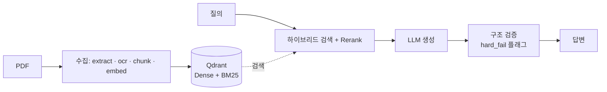

<div align="center">

# docs-rag

**한국어 문서 RAG 파이프라인 — 검증을 곁들인 End-to-End 설계**

*구조화 PDF를 수집·검색·답변까지, 그리고 "무엇을 왜 넣고 뺐는지"까지 정직하게*

<p>
  
  
  
  
  
  
</p>

[아키텍처](docs/architecture.md) · [파이프라인](docs/pipeline.md) · [설계 회고](docs/design-retrospective.md) · [로드맵](docs/roadmap.md)

</div>

---

약관·법령·매뉴얼 같은 **한국어 구조화 PDF**를 등록하면 — 자동으로 추출·OCR·청킹·임베딩해서 인덱싱하고, **하이브리드 검색 + Rerank + LLM 답변 + 0ms 구조 검증(hard_fail 플래그)** 으로 답하는 파이프라인. 자기 교정(CRAG·Critic)도 만들었지만 **측정해보니 값을 못 해서 opt-in(기본 off)** 으로 뺐다. 도메인 비종속 — 라우팅 정규식/프롬프트만 바꾸면 재사용된다.

> 차별점은 화려한 기능이 아니라 **판단**이다. 이 repo는 완성된 제품이라기보다 *"이렇게 설계했고, 무엇을 왜 넣고 뺐는지"* 를 정직하게 남긴 기록에 가깝다 — 복잡한 레이어를 다 만들어 본 뒤 값을 못 하는 건 걷어냈다(opt-in화). 판단 근거는 [설계 회고](docs/design-retrospective.md).



> 시스템 구성은 [architecture.md](docs/architecture.md), 서빙 분기(CRAG·Critic는 opt-in)는 [pipeline.md](docs/pipeline.md).

## 핵심 특징

방향은 **단순하지만 견고하게** — 품질의 핵심(문서 처리 · 검색 · 검증)에 집중하고, 복잡한 레이어는 만들되 측정이 요구할 때만 켠다.

- **구조 보존 문서 처리** — ODL로 다단 레이아웃·읽기순서 보존, PaddleOCR로 스캔·이미지 **표를 HTML 구조 복원 → 마크다운 그리드**. 상태코드 기반 재처리로 실패 지점부터 복구
- **하이브리드 검색 + Rerank** — BGE-M3 Dense + Qdrant BM25를 RRF로 융합 + CrossEncoder 리랭킹 + sibling 복원
- **공짜 구조 검증** — 답변의 조항·수치를 정규식으로 context와 대조(0ms) → hard_fail이면 **근거와 함께 플래그**. 자동 교정 대신 전문가 검토
- **측정 기반 개선** — 평가문항(gold set)을 만들어 RAGAS·retrieval 지표로 측정 → 병목(검색/생성)을 진단해 그 축만 개선
- **정직한 설계 기록** — 라우팅·CRAG·Critic·풀 trace·가드레일은 만들되 **측정이 요구할 때만 opt-in**. 무엇을 왜 넣고 뺐는지 [설계 회고](docs/design-retrospective.md)에 공개

## 빠른 시작

```bash
# 1. 전체 스택 빌드 + 기동 (API · Celery · vLLM · Qdrant · PostgreSQL · RabbitMQ · OCR)
docker compose build && docker compose up -d
docker compose ps

# 2. 문서 등록 → 비동기 extract→ocr→chunk→embed 체인 발행
curl -X POST localhost:8002/api/v1/docs-rag/documents \
  -H 'Content-Type: application/json' \
  -d '{"service_code":"01","document_id":"0001","document_name":"약관.pdf","document_path":"/data/input/약관.pdf"}'

# 3. 질의 → 검색 + 생성 + 구조 검증, 응답에 trace_id·citations 포함
curl -X POST localhost:8002/api/v1/docs-rag/answer \
  -H 'Content-Type: application/json' \
  -d '{"query":"무면허운전 시 보험금 지급이 되나요?","service_code":"01"}'
```

구성·포트: [architecture.md](docs/architecture.md), 명령 alias: [Makefile](Makefile).

## 어떻게 동작하나

### 수집 — `extract → ocr → chunk → embed`

| 스테이지 | 하는 일 |
|---|---|
| **extract** | ODL로 PDF → Markdown + 이미지. 읽기순서·구조 보존, 로컬 실행 |
| **ocr** | 삽입·스캔 이미지를 PaddleOCR PP-StructureV3로 구조화 — **표는 HTML 구조 복원 → 마크다운 그리드** |
| **chunk** | 정규화 + 룰베이스 청킹 (heading 경계 / paragraph·table·list 보존 / 조항 참조 추적) |
| **embed** | BGE-M3 1024d → Qdrant (Dense + BM25). 상태코드로 실패 지점부터 재처리 |

### 서빙 — `POST /answer`

**라우팅 → 하이브리드 검색 → Rerank → LLM 생성 → 0ms 구조 검증(플래그)** 순. hard_fail이어도 답은 그대로 반환하고 **경고만** 붙인다(전문가 검토용). CRAG 재검색·Critic 재생성은 **opt-in, 기본 off** — 단계별 상세는 [pipeline.md](docs/pipeline.md).

## 평가 (설계)

측정 결과를 자랑하기보다, **측정으로 스스로 개선하는 루프**를 설계했다. 정답 근거가 달린 **평가문항(gold set)** 을 만들고 아래 지표로 재는 걸 목표로 한다 — judge는 serving 모델과 분리(GPT-4o-mini)해 self-preference bias를 피한다.

| 축 | 지표 | 용도 |
|---|---|---|
| 생성 품질 | RAGAS Faithfulness · Answer Relevancy · Context Utilization | 답변이 근거를 지키는가 |
| 검색 품질 | Recall@k · MRR · nDCG (gold chunk 라벨) | 검색이 근거를 가져오는가 |
| 라우팅 | query_type 정확도 | 분류가 맞는가 |

**측정 → 병목 진단(검색이면 청킹·리랭크 / 생성이면 프롬프트·파인튜닝) → 재측정.** 초기 측정 기록과 판단 근거는 [설계 회고](docs/design-retrospective.md), 실행 계획은 [로드맵](docs/roadmap.md).

## 설계 철학 · 한계

> **측정된 것만 메인 경로에.** 검증 안 된 컴포넌트를 끼우면 false positive가 신뢰도를 오히려 깎는다.

- 복잡한 레이어(Adaptive 라우팅 · CRAG · Critic 재생성 · 12-섹션 trace · 4층 가드레일)는 **만들어 두되 트래픽·측정이 요구할 때만 opt-in**. 초기 측정상 대부분 현 단계엔 불필요했다.
- 구조 검증은 조항·수치의 **존재**만 본다 — 의미 반전("보장하지 아니한다" vs "보장된다")은 못 잡는다. 검증된 한국어 NLI judge가 나오면 `semantic_judge` 슬롯으로 확장.
- 무엇을 왜 넣고 뺐는지 · 아직 못 잡는 케이스 · 초기 실측 → [설계 회고](docs/design-retrospective.md).

## 로드맵 — 측정 → 조건부 파인튜닝

측정이 병목을 가리킬 때만 손댄다. 전체 설계는 [roadmap.md](docs/roadmap.md).

| Phase | 내용 | 트리거 |
|---|---|---|
| **0. 측정 기반** (선행) | 평가문항 + RAGAS Context P/R + Retrieval Recall@k + A/B 하네스 | — (게이트) |
| **1. BGE-M3 대조학습** | InfoNCE 임베딩 파인튜닝 | Phase 0가 **retrieval-bound** 판정 |
| **2. Qwen3 LoRA** | 도메인 어댑터 SFT (vLLM LoRA) | Phase 0가 **generation-bound** 판정 |

## 기술 스택

| 영역 | 구성 |
|---|---|
| Runtime | Python 3.10 · FastAPI · uv · Celery + RabbitMQ · Docker Compose |
| 검색·임베딩 | BGE-M3 1024d + Qdrant BM25 · RRF · `bge-reranker-v2-m3` |
| LLM | Qwen3-4B-AWQ (vLLM, 8GB 프로파일) — OpenAI 호환 API로 교체 가능 |
| OCR | PaddleOCR PP-StructureV3 (layout+table+formula+OCR, CPU) |
| 저장 | PostgreSQL(메타) + Qdrant(벡터DB) |
| 하드웨어 | 로컬 RTX 4060 Laptop 8GB · WSL2(Ubuntu) · 16-core · Docker |

## 기여

- **개발 환경** — `docker compose up -d` 후 `uv run pytest tests/ -v` (integration 마크는 host에서 자동 skip). 설정은 `.env`.
- **코딩 규약 · 연쇄 수정 지점** — [CLAUDE.md](CLAUDE.md) 참조.
- **새 기능 제안 전** — [설계 회고](docs/design-retrospective.md)에서 도입 트리거가 충족됐는지 먼저 확인. 새 검증 컴포넌트는 precision 측정 후에만 메인 경로에.

## 문서

| 문서 | 내용 |
|---|---|
| [docs/architecture.md](docs/architecture.md) | 시스템 구성, 포트, 데이터 흐름, 장애 대응 |
| [docs/pipeline.md](docs/pipeline.md) | 서빙 (라우팅, CRAG, 프롬프트, 구조 검증) |
| [docs/chunking.md](docs/chunking.md) | 청킹 전략 (adaptive/fixed, OCR, sibling 복원) |
| [docs/design-retrospective.md](docs/design-retrospective.md) | 설계 회고 — 판단기준(필수/유예)·초기 실측·개선 전략 |
| [docs/roadmap.md](docs/roadmap.md) | 로드맵 (측정 → 조건부 대조학습·LoRA) |
| [CLAUDE.md](CLAUDE.md) | AI 에이전트 작업 지침 |
