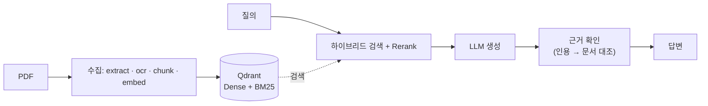
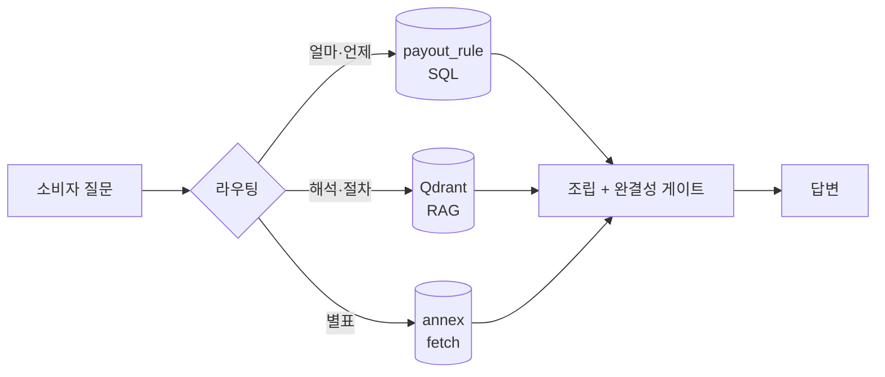

<div align="center">

# docs-rag

**한국어 문서 RAG 파이프라인** · *구조화 PDF를 수집 → 검색 → 답변까지, 무엇을 왜 넣고 뺐는지까지 정직하게.*

<p>
  
  
  
  
  
  
</p>

[아키텍처](docs/architecture.md) · [파이프라인](docs/pipeline.md) · [평가·골든셋](docs/eval-and-golden.md) · [설계 회고](docs/design-retrospective.md)

</div>

---

약관·법령·매뉴얼 같은 **한국어 구조화 PDF**를 등록하면 추출·OCR·청킹·임베딩으로 인덱싱하고, **하이브리드 검색 + Rerank + LLM 답변**까지 처리한다. 답변이 인용한 조항·숫자를 검색 근거와 대조해 어긋나면 플래그한다. 도메인 비종속 — 라우팅 정규식과 프롬프트만 바꾸면 재사용된다.

> **차별점은 화려한 기능이 아니라 판단이다.** CRAG·Critic 같은 레이어를 다 만들어 본 뒤 **측정해서 값을 못 하는 건 걷어냈다.** 판단 근거는 [설계 회고](docs/design-retrospective.md).


```mermaid
flowchart LR
    PDF[PDF] --> ING["수집: extract · ocr · chunk · embed"] --> QD[("Qdrant<br/>Dense + BM25")]
    Q[질의] --> RET["하이브리드 검색 + Rerank"] --> GEN["LLM 생성"] --> VER["근거 확인<br/>(인용 → 문서 대조)"] --> ANS[답변]
    QD -.검색.-> RET
```

**현재 코퍼스** — 보험약관 **11문서·13,080청크·5개 회사**(라이나·AXA·다이렉트·KB·회사미상). 처음 5문서(758청크)에서 KB 대형약관(자녀보험 1,237p→7,198청크 등)·회사미상 문서까지 **17배 확장** — 표준약관 백본 덕에 회사·구조가 달라도 같은 파서로 일반화. 대형 약관 색인은 **ODL Java 힙(`-Xmx`)·GPU 임베딩 토글**로 실용화(회사 넘어 확장 중 발견·수정, [STATUS](docs/STATUS.md)). **17배·5개 회사로 키워도 검색 recall@5=1.0 무회귀**(cross-doc 오염 0 — 다른 회사 유사 조가 기존 정답을 밀어내지 않음). *단 새 문서엔 아직 골든 라벨이 없어 신규 회사 콘텐츠 품질은 골든 확장 후 측정(로드맵 A3).*

## 핵심 특징

- **구조 보존 문서 처리** — ODL로 다단 레이아웃·읽기순서 보존, PaddleOCR로 스캔·이미지 **표를 마크다운 그리드로 복원**. 상태코드 기반 실패 지점부터 재처리.
- **하이브리드 검색 + Rerank** — BGE-M3 Dense + Qdrant BM25를 RRF로 융합, CrossEncoder 리랭킹, sibling 복원. **리랭커 입력 = 임베딩 텍스트(heading+content) 일관성**이 핵심 레버.
- **근거 확인** — 답변이 인용한 조항·숫자가 검색 근거에 있는지 **조(條) 단위**로 대조(정규식, 0ms). 없으면 플래그하되 답은 그대로 반환(전문가 검토용, 자동 교정 없음).
- **결정론 SQL 경로** — "얼마·언제·보장범위"처럼 틀리면 안 되는 값은 RAG 대신 관계형 테이블에서 결정론으로 집어온다. 못 뽑으면 NULL→RAG(precision-first).
- **측정 기반 개선** — 골든셋으로 recall@k·RAGAS를 재고 병목(검색/생성)을 진단해 그 축만 고친다. 라우팅·CRAG·Critic·가드레일은 만들어 두되 **기본 꺼두고 측정이 요구할 때만 켠다**.

## 빠른 시작

```bash
# 0. 스택 없이 관계형 추출·조립 자립 검증 (골든 10종 + 전처리 게이트) — 배포 관문
make check                    # 회귀 시 exit 1

# 1. 전체 스택 빌드 + 기동 (API · Celery · vLLM · Qdrant · PostgreSQL · RabbitMQ · OCR)
docker compose build && docker compose up -d

# 2. 문서 등록 → 비동기 extract→ocr→chunk→embed 체인
curl -X POST localhost:8002/api/v1/docs-rag/documents -H 'Content-Type: application/json' \
  -d '{"service_code":"01","document_id":"0001","document_name":"약관.pdf","document_path":"/data/input/약관.pdf"}'

# 3. 질의 → 검색 + 생성 + 근거 확인 (응답에 trace_id·citations·verification 포함)
curl -X POST localhost:8002/api/v1/docs-rag/answer -H 'Content-Type: application/json' \
  -d '{"query":"무면허운전 시 보험금 지급이 되나요?","service_code":"01"}'

# 3-1. 가볍게 확인 — CLI 한 줄 (라우팅·답·근거를 사람이 읽게 편다)
uv run python scripts/ask.py "중환자실 하루 얼마?"        # SQL 경로 → 결정론 즉답
uv run python scripts/ask.py "충치는 어떻게 정의되나요?"   # RAG 경로 → 근거 조(생성은 vLLM 필요)

# 4. 검색 골든 채점 (recall@k·MRR, 스택 필요 — 검색≠생성 분리 진단)
make eval-retrieval           # baseline 대비 회귀 시 exit 1
```

구성·포트는 [architecture.md](docs/architecture.md), 명령 alias는 [Makefile](Makefile) 참조.

## 어떻게 동작하나

**수집** `extract → ocr → chunk → embed` — ODL로 PDF→Markdown+이미지(읽기순서 보존) → PaddleOCR로 표 HTML 복원 → heading 트리 기반 청킹(조항 경계·표·리스트 보존) → BGE-M3 1024d → Qdrant(Dense+BM25). 상태코드로 실패 지점부터 재처리.

**서빙** `POST /answer` — 라우팅 → 하이브리드 검색 → Rerank → LLM 생성 → 근거 확인. 근거 밖 참조는 답을 막지 않고 경고만. CRAG·Critic 기본 꺼짐. 상세: [pipeline.md](docs/pipeline.md).

## 결정론 계층 — 약관 관계형 추출 (SQL 경로)

RAG(확률적 해석)와 별개로 **값이 정해진 사실은 인덱싱 때 한 번 뽑아 관계형 테이블에 넣고 질의 때 SQL로 집어온다.** "얼마·언제·보장범위"에 확률적 검색 대신 결정론 답을 주는 3경로 설계.


```mermaid
flowchart LR
    Q[소비자 질문] --> R{라우팅}
    R -->|얼마·언제| SQL[("payout_rule<br/>SQL")]
    R -->|해석·절차| RAG[("Qdrant<br/>RAG")]
    R -->|별표| F[("annex<br/>fetch")]
    SQL --> AS["조립 + 완결성 게이트"]
    RAG --> AS
    F --> AS
    AS --> ANS[답변]
```

| 소비자 질문 | 소스 | 방식 |
|---|---|---|
| 얼마 받아요? | `payout_rule` (지급률·한도·감액) | 지급기준표 행분해 — 룰베 프로파일 + 불규칙 표는 LLM 폴백 |
| 언제부터/까지? | 감액·면책기간 · 청약철회·갱신·만기 | 조 본문 추출 — 특약은 준용이라 **NULL이 정답** |
| 보장돼요? | `judge_coverage` (별표3 ICD) | 코드 범위 판정 — 담보특정성·제외우선·판정불가 |
| 뭐가 면책? | `coverage_exclusion_map` | 담보→면책 **강제첨부**(점수 무관) |

**답변 = 조회가 아니라 조립.** 특약·보통약관·별표에 흩어진 조각을 준용·강제첨부로 해소해 모으고, **완결성 게이트**가 필수 요소(면책 등) 누락을 검출한다. 보장판정이 지급률을 게이팅해 모순을 화해한다 — 예: *"D05는 암진단자금 미보장 → 제자리암 담보 10%"*.

**상태**: 관계형 테이블 **실 DB 적재 완료**(product 41·clause 307·payout_rule 94/4상품) + **3경로 라우팅 서빙 중**. `/answer`가 결정론 질의를 **자동으로 SQL 경로**로 보낸다(LLM 미호출, `route.strategy="sql"`) — **"얼마·지급률"**→`payout_rule`(+면책 강제첨부), **"청약철회·갱신"**→`product`(준용 NULL), **"이 병 보장돼요?"**→`coverage_range`(별표3 ICD 3-값 판정). 나머지·미특정은 RAG로 (게이트 + 값 특정 2중 안전, precision-first). 예: "중환자실 하루 얼마?"→`1일당 1% ※재해외 50% 감액 · 지급 제외(면책): 고의 등(제7조)`, "중환자실 특약 청약철회?"→`청약철회: 제19조 준용 소관 — 확인 필요`(억지 값 안 냄), "D05는 암진단자금 보장?"→`미보장 → 제자리암진단자금 10%`(담보특정성 + **정합 조립**: 판정에 실제 지급 담보의 payout까지 붙여 모순 없는 완결 답), "뭐가 면책?"→`고의 등(제7조) · 공통면책은 제19조 준용 소관, 미확보로 확인 필요`(특약은 자체 고유 면책만 있고 공통면책은 주계약 준용 — **없는 걸 안전하다 하지 않음**). 별도 `POST /payout`·`/terms`·`/coverage`·`/exclusion` 사이드카도 제공. 라우팅 회귀는 `make eval-sql-routing`(accuracy 1.0)로 고정. 로직 [`payout_sql.py`](src/v1/rag/payout_sql.py)(골든 5/5 실 DB). 방법론은 [eval-and-golden.md](docs/eval-and-golden.md), 도메인은 [domain-model.md](docs/domain-model.md).

## 평가 — 측정으로 자생하는 루프

수치를 자랑하기보다 **측정이 스스로 개선을 구동하는 루프**를 설계했다. 정답 근거가 달린 골든셋을 만들고 잰다(judge는 serving 모델과 분리해 self-preference bias 회피).

| 축 | 지표 | 현재 |
|---|---|---|
| 검색 품질 | recall@k · MRR (원문 앵커 라벨, 재청킹 무관) | **recall@5/@10=1.0 · @3=0.96 · @1=0.76 · MRR=0.86** (25문항·5문서) |
| 결정론 SQL | payout QA (지급률·한도) | **5/5** (실 DB payout_rule) |
| 추출·조립 | 파싱·payout·면책·완결성·reconcile 등 | **골든 10종 green** (`make check`) |
| 서빙 지연·처리량 | SQL 경로 p50 · 부하 QPS ([bench](docs/latency-bench.md)) | **SQL 경로 p50 ~6ms** (임베더·리랭커·LLM 미사용 → GPU 유무 무관) · **피크 ~183 QPS**(에러 0, 우아한 포화). retrieve floor는 모델 종속(GPU-warm sub-초) |
| 생성 품질 | RAGAS Faithfulness · Answer Relevancy | `eval_ragas.py` (Faithfulness는 대형 GPU 전제) |

> **측정이 병목을 특정하고 → 수정을 검증한다.** 예: 청킹 heading만 고쳤을 땐 recall이 안 움직였는데, 측정이 진짜 레버(리랭커 입력=임베딩 텍스트 일관성)를 가리켜 `recall@1 0.58→0.83`. 복합약관에선 조 제목을 `- 제N조(제목)` 소괄호 리스트로 뱉어 조가 붕괴하던 것을 승격 규칙으로 해소. 실측 기록은 [eval-and-golden.md §9](docs/eval-and-golden.md)·[설계 회고](docs/design-retrospective.md).

## 설계 철학 · 한계

> **측정된 것만 메인 경로에.** 검증 안 된 컴포넌트를 끼우면 false positive가 신뢰도를 오히려 깎는다.

- 복잡한 레이어(Adaptive 라우팅·CRAG·Critic·풀 trace·가드레일)는 만들어 봤지만 초기 측정상 대부분 불필요해 **기본 꺼둠**.
- 근거 확인은 조항·수치의 **존재**만 본다 — 의미 반전("보장한다" vs "보장하지 아니한다")은 못 잡는다([검증 재설계](docs/verification-redesign.md), 측정 게이트 통과 시 도입).
- 무엇을 왜 넣고 뺐는지·아직 못 잡는 케이스 → [설계 회고](docs/design-retrospective.md).

## 기술 스택

| 영역 | 구성 |
|---|---|
| Runtime | Python 3.10 · FastAPI · uv · Celery + RabbitMQ · Docker Compose |
| 검색·임베딩 | BGE-M3 1024d + Qdrant BM25 · RRF · `bge-reranker-v2-m3` |
| LLM | Qwen3-4B-AWQ (vLLM, 8GB 프로파일) — OpenAI 호환 API로 교체 가능 |
| OCR | PaddleOCR PP-StructureV3 (layout+table+formula+OCR, CPU) |
| 저장 | PostgreSQL(메타·관계형) + Qdrant(벡터DB) |
| 하드웨어 | 로컬 RTX 4060 Laptop 8GB · WSL2 · Docker |

## 문서

[**STATUS**(작업현황)](docs/STATUS.md) · [architecture](docs/architecture.md) · [domain-model](docs/domain-model.md) · [eval-and-golden](docs/eval-and-golden.md) · [latency-bench](docs/latency-bench.md) · [data-staging](docs/data-staging.md) · [pipeline](docs/pipeline.md) · [chunking](docs/chunking.md) · [design-retrospective](docs/design-retrospective.md) · [roadmap](docs/roadmap.md) · [CLAUDE.md](CLAUDE.md)

> **한눈에 보기** — **[deokjinlog.github.io/docs-rag](https://deokjinlog.github.io/docs-rag/)** : 3경로 아키텍처 + 실측 스코어보드 한 장 요약(라이브 렌더, 라이트·다크 테마 대응). 소스 [docs/portfolio.html](docs/portfolio.html).

> 개발: `docker compose up -d` 후 `uv run pytest tests/ -v`(integration 마크는 host에서 자동 skip). 새 검증 컴포넌트는 **precision 측정 후에만** 메인 경로에.
