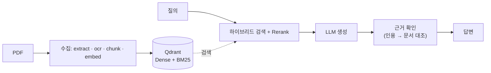
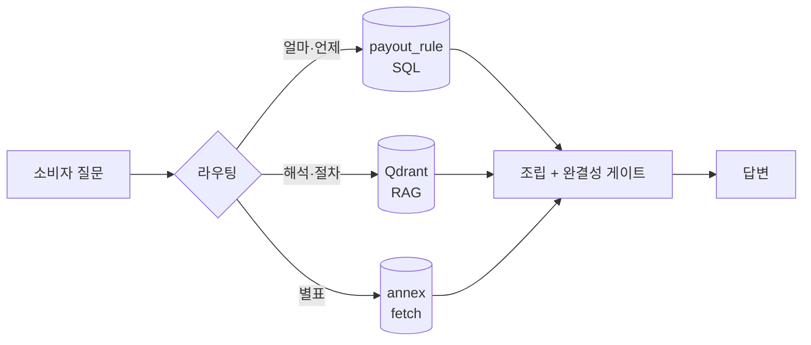

<div align="center">

# docs-rag

**한국어 문서 RAG 파이프라인** · *구조화 PDF를 수집 → 검색 → 답변까지, 무엇을 왜 넣고 뺐는지까지 정직하게.*

<p>
  <a href="https://github.com/deokjinlog/docs-rag/actions/workflows/ci.yml"></a>
  
  
  
  
  
</p>

[아키텍처](docs/architecture.md) · [파이프라인](docs/pipeline.md) · [평가·골든셋](docs/eval-and-golden.md) · [설계 회고](docs/design-retrospective.md)

</div>

---

약관·법령·매뉴얼 같은 **한국어 구조화 PDF**를 등록하면 추출·OCR·청킹·임베딩으로 인덱싱하고, **하이브리드 검색 + Rerank + LLM 답변**까지 처리한다. 답변이 인용한 조항·숫자를 검색 근거와 대조해 어긋나면 플래그한다. 도메인 비종속 — 라우팅 정규식과 프롬프트만 바꾸면 재사용된다.

> **차별점은 기능이 아니라 판단이다.** CRAG·Critic 같은 레이어를 다 만들어 본 뒤 **측정해서 값을 못 하는 건 걷어냈다.** 근거는 [설계 회고](docs/design-retrospective.md).


```mermaid
flowchart LR
    PDF[PDF] --> ING["수집: extract · ocr · chunk · embed"] --> QD[("Qdrant<br/>Dense + BM25")]
    Q[질의] --> RET["하이브리드 검색 + Rerank"] --> GEN["LLM 생성"] --> VER["근거 확인<br/>(인용 → 문서 대조)"] --> ANS[답변]
    QD -.검색.-> RET
```

## 핵심 특징

- **적응형 인제스트 캐스케이드** — 페이지를 규칙으로 분류(실측 NATIVE 94.7% · 스캔 5.3%)해 **싼 경로부터** 태우고 신호가 있을 때만 OCR·VL로 격상. 다단 읽기순서는 파서(ODL·hybrid·VL)가 **셋 다 못 잡아서** bbox 재구성이 복원한다 — 실측으로 확인한 사실이지 기대가 아니다. 상태코드 기반 실패 지점부터 재처리.
- **하이브리드 검색 + Rerank** — BGE-M3 Dense + Qdrant BM25를 RRF로 융합, CrossEncoder 리랭킹, sibling 복원. **리랭커 입력 = 임베딩 텍스트(heading+content) 일관성**이 핵심 레버.
- **결정론 SQL 경로** — "얼마·언제·보장범위"처럼 틀리면 안 되는 값은 RAG 대신 관계형 테이블에서 결정론으로 집어온다. 못 뽑으면 NULL→RAG(precision-first).
- **2단 의도 라우팅** — 정규식 게이트가 먼저 잡고, 전부 놓칠 때만 임베딩 시맨틱 라우터가 받는다. 점수·마진 미달이면 **기권**(→기존 흐름). held-out precision 0.952 · 오라우팅 0.036.
- **근거 확인** — 답변이 인용한 조항·숫자가 검색 근거에 있는지 **조(條) 단위**로 대조(정규식, 0ms). 없으면 플래그하되 답은 그대로 반환(전문가 검토용, 자동 교정 없음).
- **파싱이 깨졌는지 스스로 안다** — 정답 문서 없이 원본 PDF 를 기준선 삼아 조 보존율·글자 커버리지를 잰다. 현재 **조 보존 22/22 문서 누락 0**. 기준선 대비 회귀만 차단해서 게이트가 영구 적색이 되지 않게 한다.
- **측정 기반 개선** — 골든셋으로 recall@k·RAGAS를 재고 병목(검색/생성)을 진단해 그 축만 고친다. 라우팅·CRAG·Critic은 만들어 두되 **기본 꺼두고 측정이 요구할 때만 켠다**.

## 빠른 시작

```bash
# 0. 스택 없이 추출·조립 자립 검증 — 배포 관문 (회귀 시 exit 1)
make check

# 1. 스택 기동 — **프로필로 나눠 뜬다** (전부 띄우면 15Gi WSL 을 넘겨 통째로 죽는다)
make serve      # 9.0Gi  api·vllm    — /answer·/retrieve
make ingest     # 8.5Gi  celery·odl  — extract→chunk→embed
make ocr        # 10.0Gi paddle(GPU) — ocr 큐만
make mem-budget # 프로필별 합계가 11Gi 이하인지 기계 검증

# 2. 문서 등록 → 비동기 extract→ocr→chunk→embed
curl -X POST localhost:8002/api/v1/docs-rag/documents -H 'Content-Type: application/json' \
  -d '{"service_code":"01","document_id":"0001","document_name":"약관.pdf"}'

# 3. 질의 → 검색 + 생성 + 근거 확인 (trace_id·citations·verification 포함)
curl -X POST localhost:8002/api/v1/docs-rag/answer -H 'Content-Type: application/json' \
  -d '{"query":"무면허운전 시 보험금 지급이 되나요?","service_code":"01"}'

# 4. CLI 한 줄로 확인
uv run python scripts/ask.py "중환자실 하루 얼마?"
uv run python scripts/check_parsing.py 중환자실 7   # 제7조 항①→호1.→목가. 정밀 뷰

# 5. 채점 (스택 필요)
make eval-retrieval   # 검색 골든 recall@k·MRR·dup@10 — 조문/표/중복 3축 분해
make eval-parse       # 파싱 불변 조건 — 조 보존·글자 커버리지 (기준선 대비 회귀)

# 6. 파괴적 작업 전엔 반드시
make backup           # pg_dump + Qdrant 스냅샷
```

구성·포트는 [architecture.md](docs/architecture.md), 명령 alias는 [Makefile](Makefile).

## 어떻게 동작하나

**수집** `extract → ocr → chunk → embed` — 페이지 triage → ODL로 PDF→Markdown+이미지 → **bbox 재구성으로 읽기순서 복원**(파서 출력을 그대로 믿지 않는다) → 이미지는 OCR, 안 풀리면 VL → heading 트리 기반 청킹(조항 경계·표 보존) → BGE-M3 1024d → Qdrant(Dense+BM25). 상태코드로 실패 지점부터 재처리.

**서빙** `POST /answer` — 라우팅 → 하이브리드 검색 → Rerank → LLM 생성 → 근거 확인. 근거 밖 참조는 답을 막지 않고 경고만. CRAG·Critic 기본 꺼짐. 상세: [pipeline.md](docs/pipeline.md).

## 결정론 계층 — 약관 관계형 추출

RAG(확률적 해석)와 별개로 **값이 정해진 사실은 인덱싱 때 한 번 뽑아 관계형 테이블에 넣고 질의 때 SQL로 집어온다.**


```mermaid
flowchart LR
    Q[소비자 질문] --> R{라우팅}
    R -->|얼마·언제| SQL[("payout_rule<br/>SQL")]
    R -->|해석·절차| RAG[("Qdrant<br/>RAG")]
    R -->|별표| F[("annex<br/>fetch")]
    SQL --> AS["조립 + 완결성 게이트"]
    RAG --> AS
    F --> AS
    AS --> ANS[답변]
```

| 질문 | 경로 | 답의 성격 |
|---|---|---|
| 얼마 받아요? | `payout_rule` | `1일당 1% ※재해외 50% 감액 · 면책: 고의 등(제7조)` |
| 언제까지? | `product` | `청약철회: 제19조 준용 소관 — 확인 필요` (억지 값 안 냄) |
| 이 병 보장돼요? | `coverage_range` (별표3 ICD) | `D05 미보장 → 제자리암진단자금 10%` |
| 뭐가 면책? | `coverage_exclusion_map` | 고유 면책 + 준용 미확보 명시 |
| X 담보 있어? | 특약 catalog | 없으면 부재 단정 안 하고 RAG |
| 언제부터 온전히? | 면책기간·감액 | 가입 후 90일 보장제외 · 1년간 50% |

**답변 = 조회가 아니라 조립.** 특약·보통약관·별표에 흩어진 조각을 준용·강제첨부로 해소해 모으고, **완결성 게이트**가 필수 요소(면책 등) 누락을 검출한다. 보장판정이 지급률을 게이팅해 모순을 화해한다.

`/answer`가 결정론 질의를 자동으로 SQL 경로로 보낸다(LLM 미호출, `route.strategy="sql"`). 게이트 + 값 특정이 **둘 다** 성립할 때만 발동하고 아니면 RAG — 2중 안전. `POST /payout`·`/terms`·`/coverage`·`/exclusion`·`/catalog`·`/waiting` 사이드카도 제공. 로직 [`payout_sql.py`](src/v1/rag/payout_sql.py), 도메인 [domain-model.md](docs/domain-model.md).

## 인제스트 캐스케이드 — 비싼 경로는 필요한 페이지에만

모든 PDF를 한 경로로 보내면 스캔본이 들어왔을 때 **조용히 빈 텍스트**가 나온다. 페이지를 규칙(PyMuPDF 신호, 모델 없음)으로 분류해 **싼 경로를 기본으로 두고 신호가 있을 때만 격상**한다.

| 판정 | 실측 비중 | 경로 |
|---|---|---|
| NATIVE — 텍스트 레이어 정상 | **97.8%** | ODL + bbox 재구성 |
| NATIVE_SUSPECT — 레이어는 있는데 깨짐 | 0.0% | ODL·OCR 둘 다 뽑아 유효 음절 비율로 선택 |
| SCAN — 레이어 없음 | 2.2% | PP-StructureV3 (OCR) |

> **3값이다.** 예전엔 SCAN 을 SIMPLE/COMPLEX 로 갈라 각각 OCR/VL 로 보냈는데, PP-StructureV3 가
> 이미 레이아웃 탐지를 포함하므로 미리 둘로 나눌 이유가 없다. VL 은 페이지 라우팅이 아니라
> **OCR 결과를 보고 하는 격상**이고, 격상 단위도 페이지가 아니라 줄·영역이다.
>
> 판정과 근거 신호는 `tb_page_triage` 에 남는다(3,373행). 처리가 끝나면 PDF 는 `finished/` 로
> 옮겨지므로, "왜 이 페이지가 OCR 로 갔나"를 나중에 답하려면 그때의 신호가 있어야 한다.

> KB 약관 3종 **1,663페이지** 실측(`make triage`). **전량 VL 33.5시간 → 캐스케이드 12.5분(160배)**.
> 감으로 정한 임계치가 실제 분포의 빈 구간에 정확히 앉은 것도 이때 확인했다 — NATIVE 최소 66자 vs 스캔 최대 46자, 임계 50.

**분류를 LLM에 맡기지 않는다.** 98% 정확도 분류기도 1,000건이면 20건을 엉뚱한 경로로 보낸다. 규칙은 틀리는 방식이 예측 가능해 디버깅되고 페이지당 수 ms다. `garbage_ratio`를 `char_count`보다 **먼저** 보는 것도 같은 이유 — 한글 PDF의 흔한 실패는 "텍스트가 없다"가 아니라 "있는데 깨졌다"이고, 순서를 바꾸면 쓰레기가 NATIVE로 새어 조용히 색인된다.

**OCR vs VL은 대체가 아니라 캐스케이드.** 정답이 딸린 합성 스캔셋(네이티브 PDF 래스터라이즈 · 본문 6p × 열화 4변형)으로 재보니 —

| 변형 | OCR 3-gram | VL 3-gram | 속도 차 |
|---|---|---|---|
| clean 200dpi | 0.691 | **0.867** | 24x |
| low 120dpi | 0.672 | **0.883** | 33x |
| skew 2° | 0.663 | **0.874** | 23x |
| dark 감마0.6 | 0.724 | **0.855** | 27x |

VL이 일관 우세하지만 **20~33배 느리고, 열화가 심해져도 격차가 안 벌어진다.** → "깨끗하면 OCR·열화되면 VL"이 아니라 **"항상 VL이 낫고 항상 비싸다"** — 격상 신호를 이미지 품질이 아니라 **내용**(OCR confidence·표 존재·문자 수 급감)에서 찾아야 한다는 결론.

> 지표를 셋 둔 이유: **줄 recall은 OCR에**(줄 단위 출력) **CER은 VL에**(읽기순서) 편향돼 같은 데이터에서 정반대 결론이 나온다(0.75 vs 0.24 / 0.28 vs 0.76). 편향 없는 3-gram 겹침을 판정 축으로 삼았다.

상세 [ingest-cascade.md](docs/ingest-cascade.md) · [parser-vl-eval.md](docs/parser-vl-eval.md).

## 파싱 검증 — 정답 문서 없이 파손을 잡는다

"파싱이 잘 됐나"는 보통 사람이 만든 정답 문서가 있어야 답할 수 있다. 정답 없이도 잡히는
것이 하나 있는데, **같은 텍스트 레이어를 읽는 두 독립 구현을 서로 대는 것**이다 — 참조는
PyMuPDF 의 원시 덤프(`page.get_text`), 검사 대상은 그걸 마크다운 구조로 재조립한 ODL 출력.

```
조 보존율      22/22 문서 · 누락 0        (외부 법령 인용 제외 후)
글자 커버리지   문서중앙 0.974 ~ 1.080     (페이지 내 조판 중복 제거 후)
```

> ⚠ **이건 정확도가 아니라 보존율이다.** 두 구현이 *일치하나* 를 재는 것이지 *맞나* 를
> 재는 게 아니다 — 일치해도 둘 다 틀렸을 수 있다. 그래도 쓸모가 있는 건, NATIVE 페이지에서
> 텍스트 레이어는 인쇄용 원본이라 글자 자체는 이미 정확하고(폰트가 깨진 경우는 triage 의
> `garbage_ratio` 가 따로 잡는다) 여기서 나는 사고는 조 누락·페이지 스킵 같은 **양(量)의
> 손실**이기 때문이다. 양의 손실은 정답 없이 잡힌다.
>
> **못 잡는 것 4가지** — 읽기 순서가 뒤섞여도 글자 수는 같다 · 표의 행·열이 어긋나도
> 커버리지는 1.0 · SCAN 페이지는 참조 자체가 없다 · 조판 장식이 빠진 것과 본문이 빠진 것을
> 구분 못 한다(R10 의 FAIL 이 실제로 이 경우였다). 그래서 정확도는 **세 계층**으로 온다:
>
> | 계층 | 참조 | 재는 것 | 상태 |
> |---|---|---|---|
> | NATIVE 페이지 | PyMuPDF 덤프(무료) | 보존율 | ✅ 22문서 전량·자동 |
> | 표·중복 | 사람 라벨 골든 | 정답률 | ✅ 검색 골든 표 10·중복 10 (초안) |
> | SCAN 페이지 | 사람이 친 정답 텍스트 | **CER** | ⬜ 없음 — 현재 CER 수치는 전부 합성 스캔셋 |
>
> 사람이 원문 페이지와 파싱 결과를 나란히 보고 판정하는 화면도 아직 없다(CLI
> `check_parsing.py <문서> <조>` 뿐). SCAN 골든 30페이지를 그 화면 없이 만들 수 없어서,
> 뷰어가 CER 보다 먼저다.

**이 숫자는 지표를 두 번 고치고 나서야 나왔다.** 두 번 다 "임계가 틀렸나"가 아니라 *"지표가 뭘 재고 있나"* 를 물어서 나온 것이다.

| 처음 값 | 무엇이 문제였나 | 고친 뒤 |
|---|---|---|
| KB 약관 커버리지 **0.88** | 세로 탭·머리글이 한 페이지에 3~4번 렌더링되고(`제조준용규정` 260회) PyMuPDF 가 다 뽑는다. **ODL 은 올바르게 걷어내는데** 원시 글자 수로 나누니 그 정직함이 감점이 됐다 | **1.06** |
| R10 "조 3개 누락" | 문서 자신의 조가 아니라 외부 법령 인용(`「보험업법시행령」 제6조의2`) | 누락 0 |
| R11 "조 13개 누락" | 인용 제외 정규식이 법령명 안의 구분자 때문에 **한쪽만** 지웠다 | 누락 0 |

임계는 전부 **분포의 빈 구간**에 앉혔다 — 칼날 위가 아니라는 뜻이다.

| 지표 | 판정 | 임계 | 근거 |
|---|---|---|---|
| 조 누락 | FAIL | ≥ 1 | 22/22 가 0 — 지금은 안 울리고 깨지면 울린다 |
| 커버리지 문서중앙 | FAIL | < 0.99 | 빈 구간 0.974 → 0.996 |
| 커버리지 문서최소 | WARN | < 0.79 | 빈 구간 0.752 → 0.828 |
| 조 순서·희소 페이지·표 개수 차 | **임계 없음** | — | 분포에 빈 구간이 없다. 조 순서 0.632~0.761 연속 — 특약마다 제1조부터 다시 시작하니 **오름차순이 깨지는 게 정상**이다 |

**절대 판정이 아니라 기준선 대비 회귀로 막는다.** 현재 1건이 FAIL 인데 누락의 대부분이 목차 점선·세로 탭이라, 이걸로 게이트를 영구 적색에 두면 사람이 습관적으로 무시하게 된다. 알려진 상태를 `parse_baseline.json` 에 고정하고 **그보다 나빠질 때만** 차단한다.

## 운영 — 15Gi 안에서 돌리기

전 서비스를 함께 띄우면 mem_limit 합계가 WSL 을 넘어 **스택이 통째로 죽는다**(실측 4회). 한 번에 뜨는 조합을 프로필로 못박고 기계가 검증한다.

| 프로필 | 합계 | 구성 |
|---|---|---|
| `serve` | 9.0Gi | api + vllm + infra |
| `ingest` | 8.5Gi | celery + odl + infra |
| `ocr` | 10.0Gi | celery-ocr(동시성 1) + paddle(GPU) + infra |
| `inspect` | 5.0Gi | api + infra (읽기 전용) |

`make mem-budget` 이 compose 에서 합계를 재계산해 11Gi 상한을 검증하고, **한도 미설정도 실패로 센다** — 실제로 postgres·qdrant·rabbitmq 가 무제한이었다.

> **사고에서 배운 것.** `db/schema.sql` 을 손으로 실행해 문서 26·청크 8,850 을 날린 적이 있다(파일 맨 앞에 `DROP TABLE` 8줄). 비싼 것이 DB 밖(Qdrant payload·디스크 raw)에 있어서 재임베딩 없이 전량 복구했지만, 대책은 경고문이 아니라 구조다 — `schema.sql` 을 비파괴로 바꾸고 파괴는 `schema_reset.sql` 로 분리했으며, 파괴적 명령은 훅이 사람 확인으로 돌린다. `make backup` 은 pg_dump 와 Qdrant 스냅샷을 함께 뜬다.

## 평가

수치를 자랑하기보다 **측정이 스스로 개선을 구동하는 루프**를 설계했다. 정답 근거가 달린 골든셋 21종을 단계별로 쌓았다(judge는 serving 모델과 분리해 self-preference bias 회피).

| 축 | 지표 | 현재 |
|---|---|---|
| 파싱 무결성 | 조 보존율 · 글자 커버리지 (정답 문서 불필요) | **조 누락 0/22문서 · 커버리지 중앙 0.97~1.08** (3,308p, `make eval-parse`) |
| 검색 품질 | recall@k · MRR (원문 앵커 라벨, 재청킹 무관) | **recall@5/@10=1.00 · @3=0.96 · @1=0.77 · MRR=0.87** (게이트 26문항) |
| 표·중복 | 축 분해 — 표 셀 질의 / 중복 조항 질의 `dup@10` | **표 @1=0.70·MRR=0.83** · **중복 dup@10 평균 2.7 · 최대 8** (각 10문항, 초안) |
| 추출·조립 | 파싱·payout·면책·완결성·reconcile 등 | **골든 13종 green** (`make check`, 회귀 시 exit 1) |
| SQL 라우팅 | /answer 결정론 분기 (부정 5문항 포함) | **31/31 = 1.00** (`make eval-sql-routing`) |
| 의도 라우팅 (시맨틱) | held-out precision · 오라우팅률 | **precision 0.952 · 오라우팅 0.036** (28문항, `make eval-semantic-holdout`) |
| 멀티홉 에이전트 | 툴 recall · 요소 recall · 금지툴 회피 | **결정론 1.00 / 0.92 / 0.92** vs **LLM 합성 요소 recall 0.67** (12문항, `make eval-multihop`) |
| 파싱 경로 (OCR vs VL) | 3-gram 겹침 · 초/장 | **VL 0.855~0.883 vs OCR 0.663~0.724, 20~33배 느림** (`make eval-scanset`) |
| 서빙 지연 | 엔드포인트별 p50/p95 ([bench](docs/latency-bench.md)) | **SQL 4~9ms · retrieve 15.7s** — 아래 표 |
| 생성 품질 | RAGAS Faithfulness · Relevancy | `eval_ragas.py` (대형 GPU 전제) |

### 서빙 지연 — 3경로 설계의 실측 payoff

같은 질문이라도 **어느 경로로 가느냐가 2,500배**를 가른다. "얼마·언제·보장·면책"을 SQL로 보내는 이유가 이 표다.

| 경로 | p50 | p95 | 무엇을 하나 |
|---|---|---|---|
| `/terms` | **4.6ms** | 14.3ms | PostgreSQL 조회만 |
| `/exclusion` | **5.4ms** | 8.1ms | 〃 |
| `/coverage` | **6.4ms** | 13.6ms | 〃 + ICD 범위 판정 |
| `/payout` | **8.9ms** | 240.6ms | 〃 (p95 꼬리 = 첫 요청 콜드스타트) |
| `/answer` → SQL | **9.8ms** | 17.1ms | 라우팅 + SQL (LLM 미호출) |
| `/retrieve` (top_k=3) | **15,699ms** | 19,159ms | BGE-M3 임베딩 + Qdrant + CrossEncoder 리랭킹 (CPU) |

**p50/p95는 요청 1건당 시간**(처리 개수가 아니다). p95는 "스무 번 중 한 번은 이보다 느리다" — 최댓값 대신 이걸 보는 건
사고 한 번에 끌려다니지 않으면서 "자주 겪는 나쁜 경우"를 잡기 때문. `/payout`의 p50 8.9ms vs p95 240ms 격차가 그 예다
(p50만 봤으면 콜드스타트 꼬리를 놓친다).

**`/retrieve` 수치는 `top_k`에 딸려 있다.** 리랭킹 비용이 후보 수에 선형이라, 표의 15.7s는
`top_k=3`(후보 9개)일 때다. 검색 골든이 쓰는 `top_k=10`(후보 30개)에서는 실측 **52.6s** —
쌍당 1.74s vs 1.75s로 선형이 정확히 성립한다(trace 이력 3주간 p50 ≈ 50s로 안정). 즉 **CPU
리랭커가 RAG 경로의 지배적 비용**이고, `top_k`는 recall뿐 아니라 지연을 직접 곱하는 손잡이다.
SQL 경로가 이 비용을 통째로 회피하는 것이 3경로 설계의 실익.

부하 스윕(`/payout`, `make bench-load`)에선 **동시성을 8배 올려도 처리량은 1.6배(113→183 QPS)뿐이고 지연은 5.5배(7.8→42.6ms)** 뛴다.
이미 동시성 4에서 178 QPS로 포화 — **적정 동시성은 2~4**이고 그 위는 지연만 손해다.

> 로컬 RTX 4060 8GB · WSL2 · 임베더/리랭커 CPU 기준. `/retrieve`가 느린 건 하드웨어 탓이지 설계 탓이 아니며,
> 그렇기에 결정론 질의를 SQL로 빼는 이득이 이 환경에서 특히 크다.

**현재 코퍼스** — 보험약관 **22문서·8,733청크·9개 회사**(라이나·AXA·다이렉트·KB·삼성화재·삼성다이렉트·현대해상·DB손보·회사미상).
관계형은 product 1,309(특약 포함)·clause 8,084·payout_rule 235·coverage_range 83.

> **측정이 병목을 특정하고 → 수정을 검증한다.** 청킹 heading만 고쳤을 땐 recall이 안 움직였는데, 측정이 진짜 레버(리랭커 입력=임베딩 텍스트 일관성)를 가리켜 `recall@1 0.58→0.83`. 코퍼스를 5문서 758청크 → 22문서 8,733청크로 11배 키워도 **recall@5=1.00 무회귀** — 경쟁 청크가 늘어도 순위가 흐려지지 않았다. 실측 기록은 [eval-and-golden.md §9](docs/eval-and-golden.md).
>
> **그런데 recall 은 중복에 둔감하다.** 같은 조문이 여러 번 있으면 하나는 반드시 잡히니 중복 문항의 recall 이 오히려 더 높다(@5=1.00·MRR=0.90). 그래서 축을 갈라 `dup@10`(top-10 중 같은 사실을 담은 청크 수)을 따로 잰다 — **평균 2.7, 최악 8/10**(실손 5사가 표준약관을 공유). 중복 제거의 효과는 recall 이 아니라 이 숫자가 내려가는 것으로 확인한다. [§10](docs/eval-and-golden.md)

## 설계 철학 · 한계

> **측정된 것만 메인 경로에.** 검증 안 된 컴포넌트를 끼우면 false positive가 신뢰도를 오히려 깎는다.

- 복잡한 레이어(Adaptive 라우팅·CRAG·Critic·가드레일)는 만들어 봤지만 측정상 대부분 불필요해 **기본 꺼둠**.
- 근거 확인은 조항·수치의 **존재**만 본다 — 의미 반전("보장한다" vs "보장하지 아니한다")은 못 잡는다([검증 재설계](docs/verification-redesign.md), 측정 게이트 통과 시 도입).
- 무엇을 왜 넣고 뺐는지·아직 못 잡는 케이스 → [설계 회고](docs/design-retrospective.md).

**측정해서 기각한 것** — 만들고, 재고, 뺐다. 기각 근거도 골든에 남긴다:

| 후보 | 왜 뺐나 |
|---|---|
| 툴콜링으로 의도 라우팅 | held-out 정확도 **0.893** — `precision ≥ 0.9` 게이트 미달. 같은 골든에서 정규식 1.000 · 시맨틱 0.952이고 지연은 659ms vs 9.8ms |
| LLM 모델 교체 (Qwen3.5-4B-AWQ) | 가중치 2.48→3.84 GiB가 KV를 잠식(**47,808→12,672토큰, 3.8배 감소**) · 툴 정확도 0.893→**0.679** · 오라우팅률 2배. 8GB 카드에서 **KV가 곧 품질** |
| 파싱을 PaddleOCR-VL로 전환 | 다단 읽기순서 개선 **0**(다르게 틀릴 뿐) · 페이지당 260배 느림. 이미 있는 bbox 재구성이 셋 다 이긴다 |
| Block 밴드 분할 재정렬 | 합성 테스트는 통과했는데 **실문서 전량 회귀**(0.669→0.625). 원인은 전폭 블록이 페이지당 p50 16개 — 한계를 테스트로 못박고 되돌림 |
| 툴 결과를 LLM이 합성 | 툴 출력이 **같아도** 최종 답의 요소 recall 0.92→**0.67**. 위험은 '툴 선택'이 아니라 '결과 해석'에 있었다 → 결정론 조립 유지 |

## 기술 스택

| 영역 | 구성 |
|---|---|
| Runtime | Python 3.10 · FastAPI · uv · Celery + RabbitMQ · Docker Compose |
| 검색·임베딩 | BGE-M3 1024d + Qdrant BM25 · RRF · `bge-reranker-v2-m3` |
| LLM | Qwen3-4B-AWQ (vLLM, 8GB 프로파일) — OpenAI 호환 API로 교체 가능. 교체 후보는 [기준선](data/eval/llm_model_baseline.json)과 같은 채점기로 대조 |
| 라우팅 | 정규식 게이트 → BGE-M3 시맨틱 라우터(임계 0.60 · 마진 0.02, 미달 시 기권) |
| 문서 파싱 | 페이지 triage → ODL(+bbox 재구성) · PP-StructureV3(OCR) · PaddleOCR-VL(격상) |
| 저장 | PostgreSQL(메타·관계형) + Qdrant(벡터DB) |
| 하드웨어 | 로컬 RTX 4060 Laptop 8GB · WSL2 · Docker |
| 운영 | compose 프로필 4종(합계 ≤11Gi, 기계 검증) · 파괴적 명령 훅 · pg_dump + Qdrant 스냅샷 백업 |

## 문서

[**STATUS**](docs/STATUS.md) · [architecture](docs/architecture.md) · [domain-model](docs/domain-model.md) · [eval-and-golden](docs/eval-and-golden.md) · [latency-bench](docs/latency-bench.md) · [data-staging](docs/data-staging.md) · [pipeline](docs/pipeline.md) · [chunking](docs/chunking.md) · [ingest-cascade](docs/ingest-cascade.md) · [parser-vl-eval](docs/parser-vl-eval.md) · [troubleshooting-boot](docs/troubleshooting-boot.md) · [design-retrospective](docs/design-retrospective.md) · [roadmap](docs/roadmap.md) · [CLAUDE.md](CLAUDE.md)

> **한눈에 보기** — **[deokjinlog.github.io/docs-rag](https://deokjinlog.github.io/docs-rag/)** : 3경로 아키텍처 + 실측 스코어보드 한 장 요약. 소스 [docs/portfolio.html](docs/portfolio.html).

> 개발: `make up` 후 `uv run pytest tests/ -v`(integration 마크는 host에서 자동 skip). 스택이 부팅 후 안 뜨면 [troubleshooting-boot.md](docs/troubleshooting-boot.md) — `make up`이 마운트를 **호스트 파일 수와 대조**해 검증하고 어긋나면 스스로 재생성한다. 새 검증 컴포넌트는 **precision 측정 후에만** 메인 경로에.
