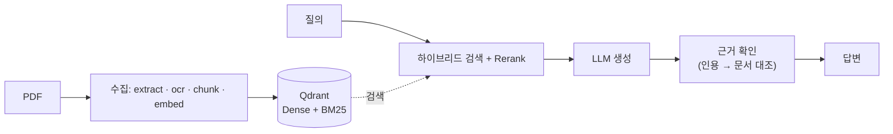

<div align="center">

# docs-rag

**한국어 문서 RAG 파이프라인**

*구조화 PDF를 수집 → 검색 → 답변까지. 무엇을 왜 넣고 뺐는지까지 정직하게.*

<p>
  
  
  
  
  
  
</p>

[아키텍처](docs/architecture.md) · [파이프라인](docs/pipeline.md) · [설계 회고](docs/design-retrospective.md) · [로드맵](docs/roadmap.md)

</div>

---

약관·법령·매뉴얼 같은 **한국어 구조화 PDF**를 등록하면 추출·OCR·청킹·임베딩으로 인덱싱하고, **하이브리드 검색 + Rerank + LLM 답변**까지 처리한다. 답변이 인용한 조항·숫자를 검색 근거와 대조해 어긋나면 플래그한다. 도메인 비종속 — 라우팅 정규식과 프롬프트만 바꾸면 재사용된다.

> **차별점은 화려한 기능이 아니라 판단이다.** CRAG·Critic 같은 복잡한 레이어를 다 만들어 본 뒤 **측정해서 값을 못 하는 건 걷어냈다.** 완성된 제품이라기보다 *"이렇게 설계했고, 무엇을 왜 넣고 뺐는지"* 를 정직하게 남긴 기록 — 판단 근거는 [설계 회고](docs/design-retrospective.md).


```mermaid
flowchart LR
    PDF[PDF] --> ING["수집: extract · ocr · chunk · embed"] --> QD[("Qdrant<br/>Dense + BM25")]
    Q[질의] --> RET["하이브리드 검색 + Rerank"] --> GEN["LLM 생성"] --> VER["근거 확인<br/>(인용 → 문서 대조)"] --> ANS[답변]
    QD -.검색.-> RET
```

## 핵심 특징

- **구조 보존 문서 처리** — ODL로 다단 레이아웃·읽기순서 보존, PaddleOCR로 스캔·이미지 **표를 HTML 구조 복원 → 마크다운 그리드**. 상태코드 기반으로 실패 지점부터 재처리.
- **하이브리드 검색 + Rerank** — BGE-M3 Dense + Qdrant BM25를 RRF로 융합, CrossEncoder 리랭킹, sibling 복원.
- **근거 확인** — 답변이 인용한 조항·숫자가 검색 근거에 있는지 정규식으로 대조(0ms). 없으면 플래그하되 답은 그대로 반환(자동 교정 없이 전문가 검토용).
- **측정 기반 개선** — gold set으로 RAGAS·retrieval 지표를 재고, 병목(검색/생성)을 진단해 그 축만 고친다.
- **정직한 설계 기록** — 라우팅·CRAG·Critic·풀 trace·가드레일은 만들어 두되 **기본은 꺼두고, 측정이 필요하다고 할 때만 켠다.**

## 빠른 시작

```bash
# 1. 전체 스택 빌드 + 기동 (API · Celery · vLLM · Qdrant · PostgreSQL · RabbitMQ · OCR)
docker compose build && docker compose up -d

# 2. 문서 등록 → 비동기 extract→ocr→chunk→embed 체인 발행
curl -X POST localhost:8002/api/v1/docs-rag/documents \
  -H 'Content-Type: application/json' \
  -d '{"service_code":"01","document_id":"0001","document_name":"약관.pdf","document_path":"/data/input/약관.pdf"}'

# 3. 질의 → 검색 + 생성 + 근거 확인 (응답에 trace_id·citations 포함)
curl -X POST localhost:8002/api/v1/docs-rag/answer \
  -H 'Content-Type: application/json' \
  -d '{"query":"무면허운전 시 보험금 지급이 되나요?","service_code":"01"}'
```

구성·포트는 [architecture.md](docs/architecture.md), 명령 alias는 [Makefile](Makefile) 참조.

## 어떻게 동작하나

**수집** — `extract → ocr → chunk → embed`

| 스테이지 | 하는 일 |
|---|---|
| extract | ODL로 PDF → Markdown + 이미지. 읽기순서·구조 보존 |
| ocr | 스캔·이미지를 PaddleOCR PP-StructureV3로 구조화 — **표는 HTML 복원 → 마크다운 그리드** |
| chunk | 정규화 + 룰베이스 청킹 (heading 경계 / table·list 보존 / 조항 참조 추적) |
| embed | BGE-M3 1024d → Qdrant (Dense + BM25). 상태코드로 실패 지점부터 재처리 |

**서빙** — `POST /answer` : 라우팅 → 하이브리드 검색 → Rerank → LLM 생성 → 근거 확인 순. 근거 밖 참조는 답을 막지 않고 경고만 붙인다. CRAG·Critic는 기본 꺼짐. 상세: [pipeline.md](docs/pipeline.md).

## 평가 — 측정으로 자생하는 루프

측정 수치를 자랑하기보다, **측정이 스스로 개선을 구동하는 루프**를 설계했다. 정답 근거가 달린 gold set을 만들고 아래 지표로 잰다 (judge는 serving 모델과 분리해 self-preference bias 회피).

| 축 | 지표 |
|---|---|
| 생성 품질 | RAGAS Faithfulness · Answer Relevancy · Context Utilization |
| 검색 품질 | Recall@k · MRR · nDCG (gold chunk 라벨) |
| 라우팅 (참고) | query_type 분포 · 오분류 spot-check |

> 라우팅은 *"유형이 라벨과 맞나"*(주관 라벨 대비라 객관 정답률이 아님)보다 *"라우팅이 실제로 품질을 올리나"*가 본질이고, 후자는 아직 미검증이다 — [설계 회고](docs/design-retrospective.md) 참조.

**측정 → 병목 진단(검색이면 청킹·리랭크 / 생성이면 프롬프트·파인튜닝) → 재측정.** 실측 기록은 [설계 회고](docs/design-retrospective.md), 실행 계획은 [로드맵](docs/roadmap.md).

## 설계 철학 · 한계

> **측정된 것만 메인 경로에.** 검증 안 된 컴포넌트를 끼우면 false positive가 신뢰도를 오히려 깎는다.

- 복잡한 레이어(Adaptive 라우팅 · CRAG · Critic · 풀 trace · 가드레일)는 만들어 봤지만, 초기 측정상 현 단계엔 대부분 불필요해 **기본 꺼둠**.
- 근거 확인은 조항·수치의 **존재**만 본다 — 의미 반전("보장한다" vs "보장하지 아니한다")은 못 잡는다. 개선 설계는 [검증 재설계](docs/verification-redesign.md)(측정 게이트 통과 시 도입).
- 무엇을 왜 넣고 뺐는지 · 아직 못 잡는 케이스 → [설계 회고](docs/design-retrospective.md).

## 로드맵 — 측정 → 조건부 파인튜닝

| Phase | 내용 | 트리거 |
|---|---|---|
| **0. 측정 기반** | gold set + RAGAS + Recall@k + A/B 하네스 | — (게이트) |
| **1. BGE-M3 대조학습** | InfoNCE 임베딩 파인튜닝 | Phase 0 = **retrieval-bound** 판정 |
| **2. Qwen3 LoRA** | 도메인 어댑터 SFT (vLLM LoRA) | Phase 0 = **generation-bound** 판정 |

## 기술 스택

| 영역 | 구성 |
|---|---|
| Runtime | Python 3.10 · FastAPI · uv · Celery + RabbitMQ · Docker Compose |
| 검색·임베딩 | BGE-M3 1024d + Qdrant BM25 · RRF · `bge-reranker-v2-m3` |
| LLM | Qwen3-4B-AWQ (vLLM, 8GB 프로파일) — OpenAI 호환 API로 교체 가능 |
| OCR | PaddleOCR PP-StructureV3 (layout+table+formula+OCR, CPU) |
| 저장 | PostgreSQL(메타) + Qdrant(벡터DB) |
| 하드웨어 | 로컬 RTX 4060 Laptop 8GB · WSL2(Ubuntu) · Docker |

## 문서

| 문서 | 내용 |
|---|---|
| [architecture.md](docs/architecture.md) | 시스템 구성, 포트, 데이터 흐름, 장애 대응 |
| [pipeline.md](docs/pipeline.md) | 서빙 (라우팅, CRAG, 프롬프트, 근거 확인) |
| [chunking.md](docs/chunking.md) | 청킹 전략 (adaptive/fixed, OCR, sibling 복원) |
| [design-retrospective.md](docs/design-retrospective.md) | 설계 회고 — 판단기준·실측·개선 전략 |
| [verification-redesign.md](docs/verification-redesign.md) | 검증 재설계 (존재 → 의미 함의, 측정 게이트) |
| [roadmap.md](docs/roadmap.md) | 로드맵 (측정 → 조건부 대조학습·LoRA) |
| [CLAUDE.md](CLAUDE.md) | AI 에이전트 작업 지침 · 연쇄 수정 지점 |

> 개발: `docker compose up -d` 후 `uv run pytest tests/ -v` (integration 마크는 host에서 자동 skip). 새 검증 컴포넌트는 **precision 측정 후에만** 메인 경로에.
