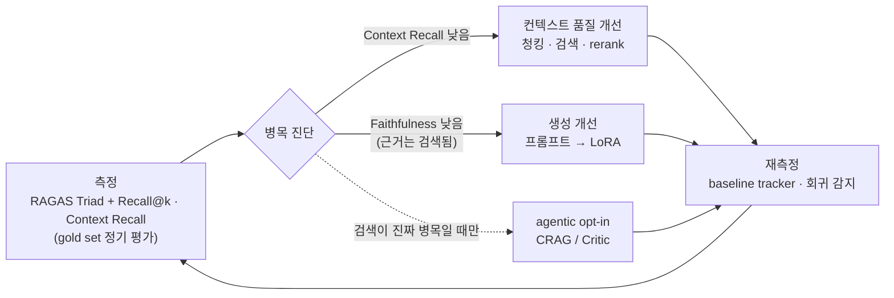

# 설계 회고 — 무엇이 필요했나 (측정 기반)

> docs-rag 서빙 파이프라인을 실제 운영 trace로 되짚어, **복잡한 에이전트 레이어가 복잡도만큼 값을 했는지** 측정하고, 앞으로 **평가 기반으로 어떻게 개선해 나갈지**를 정리한 회고. 결론은 프로젝트 철학과 같다 — *측정된 이득만 메인 경로에.*

## 한 줄 결론

검색은 이미 강했고(표준 하이브리드+rerank로 충분), 그 위에 얹은 자기교정 루프(CRAG·Critic)는 **p95 지연을 2배로 만들면서 품질을 거의 못 올렸다.** 필요했던 건 복잡한 에이전트가 아니라, **RAGAS로 자생하는 평가 루프** — 측정 → (컨텍스트 품질 개선 또는 파인튜닝) → 재측정 — 이었다. CRAG·Critic 같은 구체 설계는 그 루프가 "검색이 진짜 병목"이라고 말할 때만 켜면 된다(opt-in).

## 0. 판단기준 & 결론 (필수 vs 유예)

한 컴포넌트를 메인 경로에 넣을지 세 질문으로 판단했다 — 이 repo의 원칙 *"검증된 것만 메인 경로에"* 를 판정 가능하게 분해한 것:

1. **성립 조건** — 없으면 파이프라인이 성립 안 하는가? (청킹 없으면 검색 불가)
2. **측정된 이득 > 복잡도 비용** — 실측으로 값을 하는가?
3. **현재 상태 적합** — 닫힌 코퍼스·트래픽 0·전문가 툴에 지금 필요한가, 미래의 것인가?

하나라도 명확히 통과 → **필수(메인 경로)**, 애매하면 **유예(opt-in + 트리거)**.

> **판정 방법 (정직)** — 전 레이어를 구현한 뒤 **1회 운영 측정(trace 27건)** 으로 관찰 → 분류. 즉 *build → 측정 → 값 못 하는 건 유예.* 단 통제된 A/B가 아니라 관찰 애블레이션이고, 코드를 지운 게 아니라 **Critic만 기본 off · 나머지는 opt-in 재분류**. n=27·하루치·합성셋이라 "확정"이 아니라 *"이 데이터에선 이렇다"*.

| | 항목 | 근거 |
|---|---|---|
| **필수** (메인) | 수집·적재(상태코드 재처리) · 하이브리드 검색+rerank · grounding 프롬프트+LLM · lean 구조 검증(0ms) | 성립 조건이거나 실측 고ROI (rerank top-1 0.85 · 검증 0.5ms) |
| **유예** (opt-in+트리거) | Adaptive 라우팅 · CRAG · Critic · 12-섹션 trace · 4층 가드레일 | 실측 이득 미검증 / 현 단계 불필요 (§1 상세) |
| **설계만** (미구현) | 평가 자동화 루프(§5) · 파인튜닝([roadmap](roadmap.md)) | 측정·트래픽이 요구할 때 |

각 판정의 실측 근거는 아래 §1. 견고함은 레이어 수가 아니라 *① 수집·적재 재처리 ② 검증 신호 상시 기록 ③ 평가로 회귀 감지* 에서 온다.

## 1. 실측 — 레이어별 가성비 (trace 27건, 2026-04-29)

| 레이어 | 발동 | 비용(실측) | 효과(실측) | 판정 |
|---|---|---|---|---|
| 하이브리드 검색 + Reranker | 항상 | rerank p50 **141ms** | rerank top1 mean **0.85**, 27건 중 **17건 >0.9** | ✅ 핵심, 값함 |
| 구조 검증 (Self-RAG regex) | 항상 | verify p50 **0.5ms** | hard_fail 6건을 **공짜로 플래그** | ✅ 최고 가성비 |
| Adaptive 5-type 라우팅 | 항상 | **0ms** | 전 유형이 0.9+ — 고정 하이브리드로도 매치했을 것, factor 튜닝 이득 미검증 | ⚠️ 고정 하이브리드로 충분했을 가능성 |
| 12-섹션 서빙 trace | 항상 | 집계 machinery | 이 회고를 가능케 한 측정 기반 (가치 有) | ⚠️ 트래픽 0엔 과함 — lean trace면 족함 |
| 4층 가드레일 (PII/Injection/Output) | 항상 | ~0 (regex) | 27건 히트 **0** (내부·실사용자 0·쿼리에 PII 없음) | ⚠️ 현 단계 선구축 — 외부 노출 시로 미뤄도 됐음 |
| CRAG (게이트+재작성) | **2/26 (7.7%)** | 발동 시 +~2s | 최악 1건 0.25→0.65 구제 (그마저 rule 분해 버그가 만든 케이스) | ➖ 싼 보험, 드물게 |
| COMPARISON 분해 (rule) | comparison 4건 | +LLM 시 ~2s | rule이 **"1종 가 뭔가요"** 오생성, comparison 4건 중 **2건 refusal** | ⚠️ 복잡한데 효과 못 냄 |
| **Critic 재생성** | **7/26 (26.9%)** | **+3.5~10s (p95 14.4s의 주범)** | 7건 중 **1건만 개선(14%)**, 6건 hard_fail 그대로 | ❌ **과설계** |

**세 가지 발견**

1. **기본 파이프라인은 이미 ~3–6초에 잘 끝난다** (강한 검색 + 리랭킹 + LLM 1회 + 공짜 검증). p95 **14.4초**는 거의 전적으로 에이전트 애드온(Critic 재생성, comparison+CRAG) 때문.
2. **Critic 재생성이 명백한 과설계** — 27%에 발동해 매번 LLM을 한 번 더(3.5~10s) 태우는데 7건 중 1건만 고침. GPU ~50초를 추가로 써서 1건 구제.
3. **약점은 검색이 아니라 생성** — trace #5는 rerank **0.99**(완벽 검색)인데 LLM이 refusal. 즉 검색 쪽에 기계를 더 붙여도 소용없고, 남은 이득은 생성 쪽(프롬프트·파인튜닝).
4. **메타 패턴 — production 기계를 트래픽 0에 미리 다 박았다.** Adaptive 라우팅·12-섹션 trace·4층 가드레일·자기교정 모두 "고트래픽 production"을 가정한 선(先)구축인데, 실제는 닫힌 고품질 코퍼스 · 트래픽 0 · 실사용자 0. 라우팅은 고정 하이브리드로 충분했을 가능성이 크고, 가드레일은 히트 0, 12-섹션 집계는 lean trace면 족했다.

**그래서 "단순하지만 견고한" 최소 세트는:** 좋은 수집·적재(상태코드 재처리) + 하이브리드 검색·rerank + grounding 프롬프트 + **lean trace** + **RAGAS 평가 루프**. 나머지(라우팅·CRAG·Critic·풀 trace·가드레일)는 **측정·트래픽이 요구할 때 opt-in**. 견고함은 레이어 수가 아니라 *(1) 수집·적재 재처리 (2) 검증 신호를 항상 남기는 것 (3) 평가로 회귀를 잡는 것* 에서 온다.

## 1.5 심화 — hard_fail 정밀도 실측 (0/6, 전부 오탐)

구조 검증이 hard_fail로 잡은 6건의 답변을 까서, *놓쳤다는 조항이 문서에 실제로 있는지* 원문(.md) grep으로 확인했다:

| 질문 | 플래그된 참조 | 문서 존재 | 실제 유형 |
|---|---|---|---|
| 음주운전 지급? | 제43·44·45조 | 제43조 **116회** 등 전부 | retrieval_gap (답변은 정답) |
| 청구 절차 | 제9·10조·별표2 | 전부(제9조 100회…) | retrieval_gap |
| 계약 해지 | 제35조·제36조 1·2·4항 | 제36조는 context에(항만 다름) | 계층 과엄격 |
| 심신상실 자해 | 제7조 | 제7조 **684회** | retrieval_gap (답변 정답) |
| 미지급 사유 | 제5·10·25·38조 | 전부 + "제7장 제5조"→제5조 collapse | 장(章) collapse |
| 해약환급금 | 제36조 제2항 | 제36조는 context에 | 계층 과엄격 |

**6/6 전부 오탐. 진짜 환각(문서에 없는 조항) 0건.** 답변이 인용한 조항은 모두 실제 문서에 존재(수십~수백 회)했고, 검색이 top-3에 안 담았을 뿐이다. 이 플래그는 *환각 탐지기*가 아니라 사실상 **retrieval-gap · 계층 불일치 탐지기**였다.

**함의:**
1. **Critic auto-regenerate가 왜 무용했는지 확증** — 정답을 환각으로 오판하고 재생성했으니 개선될 리가 없다 (14% = 우연).
2. **무해했던 이유** — hard_fail은 **플래그만** 하고 답을 막지 않으며 Critic은 off → 오탐이 답을 오염시키지 않는다.
3. **올바른 대응은 재생성이 아니라** (a) 계층 매칭을 조(條) 단위로 (b) 장(章) 파싱 (c) retrieval recall↑(top_k·sibling). semantic_judge 이전에 **검증기 자체의 정밀화** 문제.

관찰 애블레이션을 넘어 **플래그 정밀도까지 실측**한 결과 — n은 작아도(6건) 방향은 분명하다.

## 2. 표준(범용) RAG는 어디까지 하는가 — 근거

대부분의 팀이 2024–2026에 실제로 배포하는 RAG는 선형 파이프라인이다: **parse → chunk → embed → 하이브리드 검색(dense + BM25) → cross-encoder rerank → grounding 프롬프트로 LLM 생성.** Anthropic **Contextual Retrieval**이 이 형태의 대표 레퍼런스이고, 프레임워크는 LangChain / LlamaIndex / Haystack. **CRAG·Self-RAG·critic 루프는 표준에 없다 — 선택적 오버레이일 뿐이다.** 즉 **이 프로젝트의 base가 곧 표준 RAG**다.

**성능 밴드 (RAGAS)** — 우리 수치를 정직하게 위치시키면:

| 지표 | 우리 값 | 표준 RAG 밴드 | 해석 |
|---|---|---|---|
| Context Utilization | **0.92** | "good retrieval" 밴드 | 진짜 강함 — 이 시스템의 실질 품질 신호 |
| Faithfulness | **0.69** | curated 0.85–0.95, 하드 실도메인은 그 아래 | 하드 한국어 코퍼스에선 정상–개선여지. **에이전트 루프가 이걸 못 올렸다** |

**retrieve+rerank가 고ROI 핵심** — Anthropic 실측: 컨텍스추얼 하이브리드 검색이 top-20 실패를 5.7% → 2.9%(−49%), **리랭킹 추가로 1.9%(−67%)**. 최대 단일 이득이 다운스트림 추론 루프가 아니라 **검색+리랭킹**에서 나왔다. 리랭킹은 <200ms에 NDCG@10 5–15pt 상승.

→ **결론: 표준 하이브리드+rerank만으로 이 품질(0.92 utilization, 0.85 rerank)은 나왔을 것이고, 에이전트 오버레이는 그 위에 유의미한 개선을 얹지 못했다.**

## 3. 에이전트 애드온 ROI — 문헌 근거

1. **외부 피드백 없는 자기교정은 개선 못 하거나 악화** — Huang et al., *"LLMs Cannot Self-Correct Reasoning Yet"* (ICLR 2024, [2310.01798](https://arxiv.org/abs/2310.01798)). Critic가 1/7만 고친 결과의 문헌적 설명.
2. **CRAG는 retrieval evaluator로 게이트되어 검색이 좋으면 원래 드물게 발동** — Yan et al. 2024 ([2401.15884](https://arxiv.org/abs/2401.15884)). **7.7% 발동은 버그가 아니라 강한 base 검색의 정상 동작.**
3. **Self-RAG 이득은 long-form·open-domain 팩트/인용에 집중**, reflection token을 뱉도록 학습된 모델을 전제 — Asai et al. (ICLR 2024, [2310.11511](https://arxiv.org/abs/2310.11511)).
4. **에이전트 오버레이는 LLM 호출 ~5–15회(≈10×)와 수초 지연** — 우리 5.6s→14.4s p95 2배와 정확히 일치.
5. **"advanced ≠ better"** — ARAGOG ([2404.01037](https://arxiv.org/abs/2404.01037))는 여러 고급 기법이 naive RAG를 못 이겼음을 보임. **애드온은 가정하지 말고 측정할 것.**

## 4. 그럼 복잡도는 언제 정당한가 (균형)

문헌이 말하는 정당화 조건: **noisy·adversarial 검색, open-domain 웹스케일 코퍼스, long-form 생성, multi-hop·문서간 종합.** Self-CRAG의 큰 이득(PopQA/Bio/PubHealth/ARC에서 +19 / +14.9 / +36.6 / +8.1pt)은 정확히 이런 하드 오픈도메인에서 나온다. 규칙: **단발 팩트 질의엔 static RAG, 다단 추론·교차종합엔 에이전트 루프 — 그것도 매 쿼리 실행이 아니라 게이트 뒤에서.** 우리의 **닫힌 고품질 약관 코퍼스는 오버레이가 불필요한 케이스**다. 필요해지면 opt-in으로 켠다.

## 5. 그래서 필요했던 전략 — RAGAS 자생 개선 루프

복잡한 CRAG·Critic를 미리 박는 대신, **평가가 개선을 구동하는 루프**를 시스템의 중심에 둔다.

**평가지표를 어떻게 활용해 업그레이드하는가** — 지표가 병목을 가리키고, 그 축만 손본다:

| 측정 신호 | 진단 | 개선 축 |
|---|---|---|
| Context Recall / Recall@k 낮음 | 검색이 근거를 못 가져옴 | **컨텍스트 품질** — 청킹 전략, 하이브리드 배수, rerank |
| Context는 높은데 Faithfulness 낮음 | 근거는 있는데 생성이 안 지킴 | **생성** — 프롬프트 강화 → (로드맵) LoRA |
| 특정 실패 클러스터 (예: comparison refusal) | 특정 질의 유형 취약 | 타깃 개선 (분해 방식 등) |
| 검색이 반복적으로 부족 | 진짜 retrieval 병목 | 이때만 **CRAG opt-in** |

**"자생 환경" 구성요소**

- **Gold eval set (versioned)** — 현재 24문항. reverse-QA 코퍼스 마이닝 + 실 trace 질의로 확장 ([roadmap.md](roadmap.md) Phase 0).
- **정기 평가 러너** — `scripts/eval_ragas.py`(judge=GPT-4o-mini 분리) + 신규 `eval_retrieval.py`(Recall@k/MRR).
- **Baseline tracker / 회귀 게이트** — 매 변경마다 before/after A/B, 유의미 하락 시 차단.
- **Feedback 환류** — `/feedback` + synthetic proxy가 gold set에 신호를 되먹임.

이 루프가 돌면 시스템이 "다음에 무엇을 고쳐야 하는지"를 **스스로 가리킨다** — 그게 자생. 상세 실행 계획은 [roadmap.md](roadmap.md).

## 6. 결정 로그

| 결정 | 내용 | 근거 |
|---|---|---|
| **Critic 기본 OFF** | `CRITIC_DISPATCH_ENABLED` 기본값 `false` (opt-in) | §1·§3 — 14% 개선 / p95 2배 |
| **comparison LLM 분해 우선** | rule 분해가 "1종 가 뭔가요" 오생성 → LLM 분해로 (코드 변경은 후속) | §1 |
| **개선은 평가 루프로** | agentic 확장 대신 측정 → 컨텍스트/파인튜닝 | §5, [roadmap.md](roadmap.md) |

## 부록 — 출처

- Anthropic, *Contextual Retrieval* — https://www.anthropic.com/news/contextual-retrieval
- Huang et al., *Large Language Models Cannot Self-Correct Reasoning Yet*, ICLR 2024 — [2310.01798](https://arxiv.org/abs/2310.01798)
- Yan et al., *Corrective Retrieval-Augmented Generation (CRAG)*, 2024 — [2401.15884](https://arxiv.org/abs/2401.15884)
- Asai et al., *Self-RAG*, ICLR 2024 — [2310.11511](https://arxiv.org/abs/2310.11511)
- *ARAGOG: Advanced RAG Output Grading*, 2024 — [2404.01037](https://arxiv.org/abs/2404.01037)
- RAGAS metrics — https://docs.ragas.io/en/stable/concepts/metrics/available_metrics/

---
## 변경이력
<!-- 회고 갱신 시 append (oldest first) -->
- 2026-07-23 · 최초 작성 — trace 27건 실측 기반 레이어 가성비 회고 + 표준 RAG 근거 + RAGAS 자생 개선 루프 전략. Critic 기본 OFF 결정.
