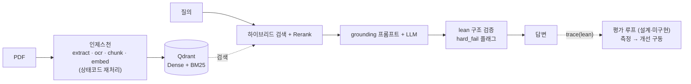

# 필수 파이프라인 — 판단기준과 설계

> 이 프로젝트를 **다시 시작한다면 무엇을 만들었을까.** [설계 회고](design-retrospective.md)의 실측(trace 27건)을 근거로, 원래 필요했던 **최소·필수 파이프라인**만 추린 설계다. 고급 레이어(에이전트 자기교정 · 풀 관측 · 평가 자동화 · 파인튜닝)는 여기서 **설계까지만** 하고, 도입 트리거가 충족될 때 구현한다.

## 판단기준 — 무엇을 "필수"로 볼 것인가

한 컴포넌트를 메인 경로에 넣을지는 세 질문으로 판단했다:

1. **성립 조건** — 없으면 파이프라인 자체가 성립하지 않는가? (예: 청킹 없으면 검색 불가)
2. **측정된 이득 > 복잡도 비용** — 실측으로 품질 기여가 확인됐고, 그 이득이 유지·지연·장애 비용을 넘는가?
3. **현재 상태에 맞는가** — *닫힌 코퍼스 · 트래픽 0 · 실사용자 0 · 전문가 검토 툴* 이라는 실제 상황에 지금 필요한가, 아니면 미래(외부 노출·트래픽·멀티도메인)의 것인가?

세 기준 중 하나라도 명확히 통과하면 **필수(메인 경로)**, 애매하면 **유예(opt-in + 트리거 명시)**. 판단의 근거 데이터는 회고에 있다.

> **왜 이 기준인가** — 이 프로젝트의 실패 모드는 "기능 부족"이 아니라 "**검증 안 된 복잡도**"였다. 그래서 기준을 *"멋있는가"* 가 아니라 *"없으면 안 되는가 / 측정으로 값을 하는가 / 지금 상황의 것인가"* 로 잡았다.

> **이 판정은 어떻게 나왔나 (방법·정직)** — 전 레이어를 구현한 뒤 **1회 운영 측정(trace 27건)** 으로 각 레이어가 실제로 몇 번 발동·개선했는지 관찰하고, 위 기준으로 필수/유예를 분류했다. 즉 *build → 1회 측정 → 값 못 하는 건 유예* 의 흐름이다. 단 **통제된 A/B 벤치마크가 아니라 관찰 기반 애블레이션**이고, 물리적으로 코드를 삭제한 것도 아니다 — Critic만 기본 off, 나머지는 opt-in으로 재분류(대부분 코드엔 아직 있음). 표본은 **n=27 · 하루치 · 합성 평가셋**이라 "확정"이 아니라 *"이 데이터에선 이렇다"*. 그래서 아래 표에 `근거 유형`(측정 / 추론 / 문헌 / 설계)을 달아 **판정의 강도**를 구분한다.

## 필수 파이프라인 (메인 경로)

| 단계 | 통과한 기준 | 판단 근거 | 근거 유형 |
|---|---|---|---|
| **인제스천** (extract·ocr·chunk·embed) | ① 성립 조건 | 코퍼스가 없으면 아무것도 안 된다. 스캔·표 처리가 **가장 어렵고 품질 상한을 정하는** 부분 | 논리(성립) |
| **상태코드 재처리** | ② 견고함 | 장애 지점부터 복구 — 재실행 비용을 낮춰 운영을 버티게 함 | 논리·구현 |
| **하이브리드 검색 + Rerank** | ② 측정된 이득 | 실측 rerank top-1 mean **0.85**. 표준 RAG 품질의 **최대 단일 이득**(Anthropic top-20 실패 5.7%→1.9%) | **측정**+문헌 |
| **grounding 프롬프트 + LLM** | ① 성립 조건 | 답변 생성 그 자체. "컨텍스트만 참고" 제약이 최소한의 환각 방어 | 논리(성립) |
| **lean 구조 검증** (0ms) | ② 거의 공짜 | 정규식 조항·수치 대조 → hard_fail **무료 플래그**. 품질을 되짚는 측정 substrate | **측정** |

이 다섯이 "단순하지만 견고한" 핵심이다. **검색이 품질을 만들고, 무료 검증이 신뢰를 만들고, 재처리가 운영을 버티게 한다.**

## 유예 — 설계는 하되 트리거까지 미구현

각 항목은 기준 ②·③에서 걸렸다. *지금 유예하는 근거* 와 *언제 켜는가(트리거)* 를 함께 못박아 dead infrastructure를 막는다.

| 항목 | 유예 근거 (기준) | 도입 트리거 | 근거 유형 |
|---|---|---|---|
| Adaptive 5-type 라우팅 | 전 유형 rerank 0.9+ → 고정 하이브리드로 매치됐을 것. factor 튜닝 이득 미측정 (②) | 유형별 검색 품질 격차가 **측정될 때** | ⚠ **추론**(관찰·A/B 아님) |
| CRAG 재검색 | 7.7% 발동 — 강한 검색의 정상 동작. 대부분 불필요 (②③) | 검색이 반복적으로 부족하다고 측정될 때 | **측정**+문헌 |
| Critic 자기교정 | 14% 개선 / p95 2배 = 손해. 외부 피드백 없는 자기교정의 한계(Huang, ICLR 2024) (②) | 외부 피드백원(전문가 라벨·NLI judge)이 생길 때 | **측정**+문헌 |
| 12-섹션 트레이스 | 트래픽 0 — route·score·risk·latency 몇 필드 **lean trace**면 족 (③) | 운영 트래픽 · 다중 producer | ⚠ **판단**(추론) |
| 4층 가드레일 | 27건 히트 0 · 내부 도구 · 쿼리에 PII 없음 (③) | 외부 노출 / 실사용자 유입 | **측정** |
| **평가 자동화 루프** (RAGAS 자생) | **설계 완료, 미구현.** 측정이 개선을 구동하는 게 옳지만, 지금은 수동 `eval_ragas.py`로 족 (③) | 변경 빈도↑ · 회귀 자동 감지 필요 → 그때 단일 러너로 구현 | **설계**(미구현) |
| **파인튜닝** (대조학습·LoRA) | **설계 완료, 미구현.** 근거 없는 학습은 재인덱싱·서빙 비용만 (②) | 측정이 retrieval / generation 병목을 지목할 때 ([roadmap.md](roadmap.md)) | **설계**(미구현) |

## 왜 이 구조가 "단순하지만 견고"한가

견고함은 **레이어 수가 아니라 세 곳**에서 온다:

1. **인제스천 재처리** — 실패가 파이프라인 전체를 멈추지 않는다.
2. **검증 신호를 항상 남긴다** — 무료 구조 검증 + lean trace → 언제든 품질을 되짚고, 틀렸을 때 전문가가 안다.
3. **평가로 회귀를 잡는다** (설계) — 개선·변경이 품질을 떨어뜨리면 감지한다.

에이전트 자기교정·풀 관측·다층 가드레일은 이 세 축을 **대체하지 못한다.** 그래서 필수에서 빠지고, 각자의 트리거를 기다린다. 복잡도를 *더하는* 게 아니라 *유예하는* 것이 이 프로젝트의 견고성 전략이다.

---

관련 문서: [설계 회고 (실측 근거)](design-retrospective.md) · [모델 고도화 로드맵 (파인튜닝)](roadmap.md) · [서빙 파이프라인 상세](pipeline.md)
